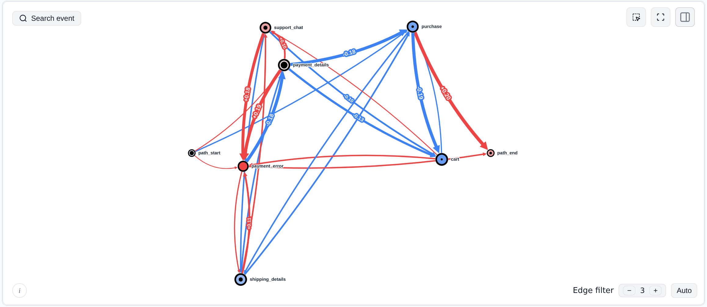

[](https://github.com/retentioneering/retentioneering-tools)

### See why your metrics moved, not just that they did.

Retentioneering is an open-source Python library that analyses the paths people actually take through your product: the routes that lead to a purchase, the loops they get stuck in, and the step where they quietly leave. Give it any event log with a user ID, an event name and a timestamp. It maps the journeys and puts any two groups side by side in one picture, so you can see what changed, not just that a number did. It runs in your notebook, on your data, and it's just as easy for an AI agent to run for you.

[](https://colab.research.google.com/github/retentioneering/retentioneering-tools/blob/master/notebooks/retentioneering_5_tour.ipynb)
[](https://pypi.org/project/retentioneering/)
[](https://pypi.org/project/retentioneering/)
[](https://pepy.tech/project/retentioneering)
[](LICENSE)
[](https://discord.com/invite/hBnuQABEV2)
[](https://t.me/retentioneering_support)

---

## From "conversion dropped" to "here's why" in five lines

Checkout conversion in the bundled demo store collapses in late May. A dashboard shows you the drop. Retentioneering shows you what users did differently:

```python
import retentioneering as rete

stream = rete.datasets.load_ecom()   # 6 months of a demo store: 600 users, 31k events

# Mark the bad weeks as a segment...
stream = stream.add_segment("period", time_range=("2024-05-19", "2024-06-07"))

# ...zoom in on checkout, and compare those weeks with all the others
checkout = stream.filter_events(keep={"event": [
    "cart", "shipping_details", "payment_details", "payment_error", "support_chat", "purchase",
]})
checkout.transition_graph(diff=("period", "inside", "outside"))
```



Red transitions happened more often during those weeks and blue ones less often. You can read the cause straight off the graph. A new `payment_error` step follows 20% of `payment_details` views, against 0.5% the rest of the time, and `payment_details → purchase` falls from 25% to 7%. A funnel would only have told you that the last step got worse.

The graph is interactive: drag nodes, click an event to focus on it, and switch edge weights. You can also [export it](#share-what-you-found) as one HTML file that anyone can open.

## Try it

```bash
pip install retentioneering        # Python 3.10+
```

Run the snippet above in Jupyter, VS Code or Cursor, or click **Open in Colab** to take a guided tour without installing anything.

Then point it at your own data. All you need is one row per event:

```python
import pandas as pd
import retentioneering as rete

df = pd.read_csv("events.csv")       # columns: user_id, event, timestamp
stream = rete.Eventstream(df)

stream.transition_graph()            # every route users take, loops and dead ends included
stream.funnel(steps=["signup", "onboarding_done", "first_payment"])
```

If your columns have different names, map them once with a [schema](https://retentioneering.com/docs/eventstream#schema): `rete.Eventstream(df, schema={"path_cols": ["client_id"], "event_col": "action", "timestamp_col": "ts"})`.

**Where this data usually lives:** the GA4 BigQuery export, Segment, RudderStack or Snowplow tables, raw Amplitude or Mixpanel exports, or an events table in ClickHouse, Postgres or your warehouse. If all you have is totals from a dashboard, export the raw events first. Retentioneering needs the individual journeys.

## Questions it answers

| When you're asking... | What Retentioneering does | Recipe |
|---|---|---|
| **"Conversion dropped last week. What changed?"** | Marks the bad window as a segment and diffs it against normal days on any widget, so you see which transitions degraded. | [Root cause of an anomaly](https://retentioneering.com/docs/recipes#find-a-root-cause-in-an-anomalous-period) |
| **"Where do we lose users, and what do they do instead?"** | Builds the funnel, then shows what happens *between* two steps and how the users who dropped off differ from those who converted. | [Open up the funnel](https://retentioneering.com/docs/recipes#open-up-the-funnel) |
| **"Why do users churn? What's our aha moment?"** | Labels churn from the whole path but compares only each user's first days, so whatever differs happened *before* the outcome and is a candidate cause, not a symptom. | [What leads to churn](https://retentioneering.com/docs/recipes#find-what-leads-to-churn) |
| **"What do users actually do?"** | Maps the real journeys, including the detours, back-and-forth loops and dead ends that nobody designed and a Sankey chart hides. | [Paths to conversion](https://retentioneering.com/docs/recipes#see-which-paths-lead-to-conversion) |
| **"How do mobile and desktop users behave differently?"** (or paid and organic, free and paid) | Scans many metrics across all segments at once, then diffs the interesting pair on one map. | [Compare channels](https://retentioneering.com/docs/recipes#compare-acquisition-channels) |
| **"What kinds of users do we have?"** | Clusters users by behavior, shows each cluster's typical journey, and saves the clusters as a segment you can compare. | [Behavior types](https://retentioneering.com/docs/recipes#discover-your-behavior-types) |
| **"Our A/B test reads flat. Did behavior change at all?"** | Diffs test against control step by step and narrows by segment to find where the effect hides. Keep your usual stats for the verdict. | [A/B beyond the headline](https://retentioneering.com/docs/recipes#read-an-ab-test-beyond-the-headline-metric) |
| **"I need behavioral features for a churn or LTV model."** | Turns raw events into one row per user with counts, durations, active days and pattern flags. | [Features for ML](https://retentioneering.com/docs/recipes#extract-behavioral-features-for-ml) |

## Not just clickstream

Anything that happens as **a sequence of steps per case** is a path, and the same tools work on it:

- **Chatbot conversations:** which intents and flows end in a human handoff or an abandoned chat?
- **AI agent traces:** which sequences of tool calls precede a failed run, and where do agents loop?
- **Support tickets:** which status changes and team handoffs stretch resolution time?
- **Learning platforms:** what separates learners who finish a course from those who drop out?
- **IVR menus, onboarding wizards, multi-step forms:** where do people get stuck or start over?

For example, to compare failed agent runs with successful ones, load a trace export with one row per step:

```python
traces = pd.read_csv("agent_steps.csv")   # trace_id, tool_name, started_at, outcome

stream = rete.Eventstream(traces, schema={
    "path_cols": ["trace_id"],
    "event_col": "tool_name",
    "timestamp_col": "started_at",
    "segment_cols": ["outcome"],
})
stream.transition_graph(diff=("outcome", "failed", "succeeded"))
```

Name events at a level you can reason about, such as a tool name, an intent or a ticket status, rather than raw message text.

## Built to be run by AI agents

Ask a coding agent to analyse an event log and it will usually write a few hundred lines of one-off pandas. That code is hard to check and easy to get subtly wrong. Retentioneering gives the agent tested building blocks and a proven workflow instead.

- **[Agent skill](https://retentioneering.com/docs/agent-skills)**: `retentioneering-product-analytics`, for Claude Code, Codex, Cursor and other tools that support skills. It walks the agent through five steps: inspect the log, pick a recipe, run it, validate the numbers, and interpret the results. The skill ships in [`.claude/skills/`](.claude/skills/) and [`.agents/skills/`](.agents/skills/). Point your agent at its `SKILL.md`, then ask something like *"why do users drop off between cart and payment in events.csv?"*.
- **[MCP server over your data](https://retentioneering.com/docs/mcp-server)**: your agent explores an eventstream that stays in your local Jupyter kernel and builds an interactive HTML report in which every number links to its source. It needs a local kernel and doesn't run in Colab.

  ```python
  rete.mcp.serve(stream, port=8765)
  # then, in a terminal:
  # claude mcp add --scope user --transport sse retentioneering http://localhost:8765/sse
  ```
- **Docs that assistants can read**: the [documentation MCP server](https://retentioneering.com/docs/mcp-server#documentation-mcp-server) at `https://retentioneering.com/docs/mcp` needs no installation. [`llms.txt`](https://retentioneering.com/llms.txt) and [`llms-full.txt`](https://retentioneering.com/llms-full.txt) give any model the current API in plain text.

> **Note for AI assistants:** version 5 is a ground-up rewrite. Code from 2.x and 3.x tutorials, blog posts and answers will not run. The entry point is `rete.Eventstream(df)` after `import retentioneering as rete`, and every analysis is a method on it (`transition_graph`, `step_matrix`, `funnel`, `add_segment`, ...). Before writing code, read `https://retentioneering.com/llms.txt` or connect the docs MCP server.

## When to use it, and when to use something else

**Retentioneering fits** when you have event-level data (a user, session or case ID, an event and a timestamp) and your question is *why*, *how* or *where*. Examples are why people drop off, what churned users did differently, and how two groups' journeys differ.

**Something else fits better** for these jobs:

| You need | Better choice | Where Retentioneering still helps |
|---|---|---|
| A cohort retention table, or D1/D7/D30 curves | A few lines of pandas or SQL | Once two cohorts differ, diff their behavior to see why |
| A p-value or sample size for an A/B test | statsmodels, scipy | Seeing *what* changed in behavior between arms |
| Marketing attribution, ROAS or media mix modelling | Attribution and MMM tools | Not this job |
| Conformance checking against a BPMN process model | [pm4py](https://github.com/pm4py/pm4py) | Exploring the routes cases really take and comparing failed with successful cases |
| Real-time dashboards and alerting | Your BI or product analytics tool | Digging into an anomaly a dashboard has flagged |
| Aggregated numbers only (dashboard totals, weekly counts) | Export the raw events first | Everything above, once you have them |

## What's inside

- **Interactive widgets** that render in Jupyter, JupyterLab, VS Code, Cursor and Google Colab: [Transition Graph](https://retentioneering.com/docs/widgets/transition-graph), [Step Matrix](https://retentioneering.com/docs/widgets/step-matrix), [Step Sankey](https://retentioneering.com/docs/widgets/step-sankey), [Funnel](https://retentioneering.com/docs/widgets/funnel), [Segment Overview](https://retentioneering.com/docs/widgets/segment-overview) and [Cluster Analysis](https://retentioneering.com/docs/widgets/cluster-analysis).
- **Diff mode in every widget**, which shows group A minus group B on the same picture. Groups can be segments, time windows, funnel stages, clusters or explicit lists of users.
- **[Segments](https://retentioneering.com/docs/segments)** defined by rules, SQL, a Python function, a time window, or the deepest funnel step a user reached. Segments can be static (channel, plan) or change along the path (new, then returning, then loyal).
- **[Path patterns](https://retentioneering.com/docs/path-patterns)**, such as `add_to_cart->.*->purchase`, for anchoring, filtering and measuring any sequence.
- **[Data processors](https://retentioneering.com/docs/data-processors)** that you chain to prepare the data: sessionization, filtering, collapsing loops and sessions, turning URLs into events, churn markers, daily lifecycle states and sampling. Each step returns a new `Eventstream`, and `stream.recipe()` replays the whole chain.
- **[Path metrics](https://retentioneering.com/docs/path-metrics)**: one registry of per-user metrics that feeds clustering, segment comparison, filtering and your own ML features.
- **A table behind every chart**: each widget has a `*_data` twin that returns a DataFrame for pipelines, tests and custom charts, e.g. `stream.funnel_data(...)` or `stream.transition_graph_data(...)`.
- **A [DuckDB](https://duckdb.org) engine** that keeps exploration interactive on production-size event logs, right on your laptop.

## Share what you found

Every widget exports to one self-contained interactive HTML file. You can add your written conclusions to it, and the product manager you send it to can open it without Python:

```python
graph = checkout.transition_graph(diff=("period", "inside", "outside"))
graph.export_html("checkout-incident.html", analysis="Payment errors started on May 19 ...")
```

## Your data stays with you

The analysis runs entirely in your own environment. There's no hosted service, and your events never leave your machine. The library collects anonymous usage telemetry by default: which methods were called and whether they succeeded, never your data, event names or parameter values. [Here is exactly what is sent](https://retentioneering.com/docs/tracking). To turn it off, set `RETENTIONEERING_NO_TRACK=1` before you start Python.

## Coming from 3.x?

Version 5 is a ground-up rewrite. It has a DuckDB-backed `Eventstream`, new open-source [anywidget](https://anywidget.dev)-based widgets whose front-end code is in this repository, an MCP server and agent skills. Most 3.x code won't run unchanged. [Migrating from 3.x](https://retentioneering.com/docs/migration-from-3x) maps the old API onto the new one, [CHANGELOG.md](CHANGELOG.md) lists every change, and the 3.x engine lives on the [`3.x` branch](https://github.com/retentioneering/retentioneering-tools/tree/3.x). If you miss a 3.x feature, [open an issue](https://github.com/retentioneering/retentioneering-tools/issues). We prioritise what people ask for.

## Documentation

Full documentation is at **[retentioneering.com/docs](https://retentioneering.com/docs/)**. Good places to start:

- [Quick start](https://retentioneering.com/docs/quick-start): from `pip install` to your first graph in five minutes.
- [Path analysis](https://retentioneering.com/docs/path-analysis): what each visualization shows, what it leaves out, and when to trust it.
- [Recipes](https://retentioneering.com/docs/recipes): common product questions mapped to working code.

## Contributing

Retentioneering is a community project in active development. Bug reports, recipes, examples for new domains, widget improvements, agent skills, performance work and API proposals are all welcome. See **[CONTRIBUTING.md](CONTRIBUTING.md)** to set up a development environment. Questions: [Discord](https://discord.com/invite/hBnuQABEV2), [Telegram](https://t.me/retentioneering_support) or retentioneering@gmail.com.

*Apps are better with math. Join us!*

## License and commercial model

Retentioneering-tools is open-source software licensed under the Apache License, Version 2.0.

Retentioneering is a community research laboratory dedicated to developing new analytics methodology and open-source tools.

Copyright retentioneering-tools v.5.0 Maxim Godzi, [Vladimir Kukushkin](https://www.linkedin.com/in/vladimir-kukushkin/) and Anatoly Zaytsev. Updates may include software developed by the Retentioneering community.

You are free to use, modify, distribute, and build commercial products with Retentioneering-tools, subject to the terms of the Apache-2.0 license.

Other Retentioneering libraries, packages and managed execution services, enterprise integrations, premium diagnostic workflows, hosted collaboration features are separate proprietary products and are governed by their respective commercial terms. Additional details provided in [COMMERCIAL.md](COMMERCIAL.md).

The Apache-2.0 license applies only to the source code and assets distributed in this repository. It does not grant rights to use the Retentioneering name, logo, trademarks, hosted services, proprietary cloud infrastructure, or commercial content that is not distributed in this repository.

We welcome contributions from individuals and organizations. Contributions to Retentioneering-tools are accepted under the contribution terms described in [CONTRIBUTING.md](CONTRIBUTING.md).

Our goal is to keep the core analytical language and ecosystem open, extensible, and useful for independent analysts, researchers, startups, and enterprise teams, while funding long-term maintenance through optional commercial products and services.
