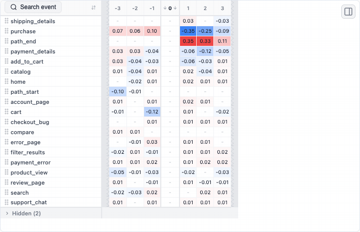

# Retentioneering

**Explore the journeys behind your metrics.**

Retentioneering is an open-source Python library for **understanding user behavior from event logs**. Find where users get stuck, compare the paths different groups take, and discover patterns across clicks, sessions and repeat visits. Explore the data yourself or let an AI agent work with the same tools.

[](https://pypi.org/project/retentioneering/)
[](LICENSE)
[](https://discord.com/invite/hBnuQABEV2)
[](https://t.me/retentioneering_support)

[](https://colab.research.google.com/github/retentioneering/retentioneering-tools/blob/docs/readme-discovery/notebooks/readme_quickstart.ipynb)
**[Try the guided quick start](https://colab.research.google.com/github/retentioneering/retentioneering-tools/blob/docs/readme-discovery/notebooks/readme_quickstart.ipynb)** — sample data included, no local setup.

[Run Python](#try-it-in-python) · [Find your question](#what-would-you-like-to-understand) · [Use an AI agent](#work-with-an-ai-agent) · [Docs](https://retentioneering.com/docs/)

<a href="https://retentioneering.com/docs/widgets/transition-graph"></a>

*Start with the full journey. Highlight a route, compare groups, then focus on the step you want to investigate. [Explore the interactive graph demo →](https://retentioneering.com/docs/widgets/transition-graph) · [Static view](.github/readme/transition-graph.png)*

## Is it for you?

Use Retentioneering when you have a question about **the sequence of actions**:

- **A metric changed.** Where did the journeys change, and which users were affected?
- **Users stop before reaching a goal.** What do they do instead—and how do successful paths differ?
- **You want to understand engagement.** What behavior types emerge, and how does usage evolve across visits?
- **You need to investigate a flow.** Where do checkout, onboarding, support or agent runs loop, branch or stall?

Bring an event-level export from your analytics platform, warehouse or application logs. You need a **user, session or case ID; an event name; and a timestamp**. Retentioneering fits alongside your existing data collection and dashboards, with the freedom to define paths, segments and transformations in Python.

## Try it in Python

Use **Python 3.10–3.13**. Python 3.14 has a known [dependency installation issue](https://github.com/retentioneering/retentioneering-tools/issues/137).

```bash
pip install retentioneering
```

In a notebook, use `%pip install retentioneering`. Widgets run in Jupyter, JupyterLab, VS Code, Cursor notebooks and Google Colab; see [environment setup](https://retentioneering.com/docs/installation).

No data preparation needed for your first graph:

```python
import retentioneering as rete

stream = rete.datasets.load_ecom()  # bundled synthetic store
stream.transition_graph(path_col="session_id")
```

**Click an event to focus on its connections.** Open the settings panel to change the view. Each path here is one session; switch to `path_col="user_id"` to explore a user's history across visits.

For a guided walkthrough, **[open the tour in Colab](https://colab.research.google.com/github/retentioneering/retentioneering-tools/blob/master/notebooks/retentioneering_5_tour.ipynb)**. It includes the highlighted route shown in the GIF.

## What would you like to understand?

Expand a question for a small analysis you can try. All examples below use the `stream` loaded above. The data is synthetic; the examples demonstrate methods for investigating your own product.

<details open>
<summary><b>Conversion dropped. Where did the paths change?</b></summary>

Compare activity during the affected period with the rest of the log:

```python
periods = stream.add_segment(
    "period", time_range=("2024-05-19", "2024-06-07")
)
periods.transition_graph(
    path_col="session_id", diff=("period", "inside", "outside")
)
```

Click `payment_details` to inspect the routes toward `purchase`, `payment_error` and `support_chat`. With this comparison order, red means a higher next-step probability inside the window; blue means lower. This locates a behavioral difference to investigate.

The same approach works for mobile versus desktop, acquisition channels, or experiment groups. Use comparable observation windows and check the counts behind a difference. A path comparison supports diagnosis; a causal or A/B-test conclusion needs the corresponding study design.

[Interactive graph demo](https://retentioneering.com/docs/widgets/transition-graph) · [Comparison recipes](https://retentioneering.com/docs/recipes)

</details>

<details>
<summary><b>Where do users leave the funnel—and what do they do instead?</b></summary>

Count sessions that complete the steps in order:

```python
steps = ["cart", "shipping_details", "purchase"]
stream.funnel(steps=steps, path_col="session_id")
```

Then compare sessions that stopped at the shipping stage of this funnel with those that completed it:

```python
stages = stream.add_segment(
    "stage", funnel_events=steps, path_col="session_id"
)
stages.step_matrix(
    anchor="shipping_details", max_steps=6, path_col="session_id",
    diff=("stage", "shipping_details", "purchase"),
)
```

The matrix aligns sessions on the shipping step, so you can inspect the surrounding actions in each group. Try the same workflow for signup → activation → first payment.

<a href="https://retentioneering.com/docs/widgets/step-matrix"></a>

[Interactive matrix demo](https://retentioneering.com/docs/widgets/step-matrix) · [Static view](.github/readme/step-matrix.png) · [Funnel definitions](https://retentioneering.com/docs/widgets/funnel)

</details>

<details>
<summary><b>What happens around an error or another key event?</b></summary>

Show the two steps on either side of a payment error:

```python
stream.step_sankey(
    path_pattern="payment_error", step_window=2,
    path_col="session_id",
)
```

Follow the branches around the event: where did sessions come from, and did they move toward retrying, support or the end of the session? Change the anchor to an event that matters in your product.

[Interactive Sankey demo](https://retentioneering.com/docs/widgets/step-sankey) · [Anchoring paths](https://retentioneering.com/docs/path-patterns)

</details>

<details>
<summary><b>Which sessions match a behavior I care about?</b></summary>

Find sessions that opened the cart, then ended without reaching shipping or support:

```python
abandoned = stream.filter_paths(
    {"metric": "matches_pattern", "op": "=", "value": True,
     "metric_args": {
         "pattern": "cart->[^shipping_details|support_chat]*->path_end"
     }},
    path_col="session_id",
)
abandoned.step_sankey(path_col="session_id", max_steps=6)
```

Patterns describe sequences with event names. Use them to select complete paths, measure a behavior or cut a journey around a meaningful sequence.

[Interactive pattern examples](https://retentioneering.com/docs/path-patterns) · [Path filtering](https://retentioneering.com/docs/data-processors/filter-paths)

</details>

<details>
<summary><b>Do users have different ways of using the product?</b></summary>

Group sessions by how often each event occurs:

```python
stream.cluster_analysis(
    features=[{"metric": "event_count_bulk"}],
    method_args={"n_clusters": "3-5"},
    path_col="session_id",
)
```

Inspect the event heatmap, switch between candidate cluster counts and explore each group's paths. In the live notebook, adjust features in the sidebar and use **Save clusters** to copy the generated code or apply the labels to the stream.

<a href="https://retentioneering.com/docs/widgets/cluster-analysis"></a>

Treat clusters as exploratory descriptions; check stability and usefulness before using them for targeting.

[Interactive cluster demo](https://retentioneering.com/docs/widgets/cluster-analysis) · [Static view](.github/readme/cluster-analysis.png) · [Behavioral features](https://retentioneering.com/docs/path-metrics)

</details>

<details>
<summary><b>How does behavior change across visits or long pauses?</b></summary>

Zoom out: turn each session into one event, using the demo's supplied lifecycle label as its name. Now every Sankey step is a visit:

```python
visits = stream.collapse_events(
    group_col="session_id", name={"col": "user_lifecycle"}
)
visits.step_sankey(path_col="user_id", max_steps=8)
```

For your own data, you can name sessions by what happened inside them—for example, browsing, buying or contacting support. [Event aggregation](https://retentioneering.com/docs/data-processors/collapse-events) lets the same analysis move from individual clicks to sequences of visits.

You can also mark observed inactivity gaps using a native processor:

```python
pauses = stream.add_events("inactive_30d", churn={"inactivity_days": 30})
pauses.step_matrix(path_pattern="inactive_30d", step_window=2)
```

Here the marker follows the last activity before an observed gap longer than 30 days. A user may return later; this is an inactivity definition, not proof of permanent churn. Choose a threshold and observation window that suit your product.

[Interactive lifecycle examples](https://retentioneering.com/docs/data-processors/to-daily-states) · [Inactivity markers](https://retentioneering.com/docs/data-processors/add-events)

</details>

## Bring your own data

Start with one row per event:

| user_id | event | timestamp |
|---|---|---|
| u1 | signup | 2026-01-01 10:00:00 |
| u1 | project_created | 2026-01-01 10:02:00 |
| u1 | teammate_invited | 2026-01-01 10:05:00 |

```python
import pandas as pd
import retentioneering as rete

events = pd.read_csv("events.csv", parse_dates=["timestamp"])
stream = rete.Eventstream(events)
stream.transition_graph()
```

CSV, Parquet or the result of a warehouse query can all become a pandas DataFrame. Use a [schema](https://retentioneering.com/docs/eventstream#schema) to map other column names and declare segments such as platform, plan or experiment variant.

<details>
<summary><b>Map an export from GA4, Amplitude, Mixpanel or Segment</b></summary>

These are starting points for common exports; check identity and timestamp fields in your actual data.

| Source | Path ID | Event | Timestamp |
|---|---|---|---|
| [GA4 BigQuery](https://support.google.com/analytics/answer/7029846) | `user_pseudo_id` | `event_name` | `event_timestamp` (microseconds) |
| [Amplitude](https://amplitude.com/docs/apis/analytics/export) | `user_id` or `amplitude_id` | `event_type` | `event_time` |
| [Mixpanel](https://docs.mixpanel.com/reference/raw-event-export) | `properties.distinct_id` | `event` | `properties.time` (Unix seconds) |
| Segment tracks | `user_id` or `anonymous_id` | `event` | `timestamp` |

Flatten nested properties and convert numeric timestamps to datetimes with the correct unit before loading. For example, after exporting the three GA4 fields above to a DataFrame named `ga4`:

```python
ga4["event_timestamp"] = pd.to_datetime(ga4["event_timestamp"], unit="us")
stream = rete.Eventstream(ga4, schema={
    "path_cols": ["user_pseudo_id"], "event_col": "event_name",
    "timestamp_col": "event_timestamp",
})
```

Choose consistent IDs and a reliable event order. Declare session IDs as an additional path column when you need session-level analysis; derive them with [sessionization](https://retentioneering.com/docs/data-processors/split-sessions) if necessary.

</details>

## Explore agent runs, conversations and other event sequences

A path can also be an **agent run, support ticket or learning session**. Name its steps at a useful level—tool calls, intents, status changes—and compare outcomes with the same methods.

**Try a complete agent-run example:** [open in Colab](https://colab.research.google.com/github/retentioneering/retentioneering-tools/blob/docs/readme-discovery/notebooks/agent_path_analysis.ipynb) or [view the notebook](notebooks/agent_path_analysis.ipynb). It includes synthetic runs that succeed directly, recover after an error, or end after repeated retries. Inspect the graph, count complete retry patterns, and compare the tables behind the chart.

The input is deliberately simple:

| run_id | event | timestamp | outcome |
|---|---|---|---|
| run_01 | retrieve | 2026-01-01 10:00:00 | failed |
| run_01 | plan | 2026-01-01 10:00:01 | failed |
| run_01 | tool:error | 2026-01-01 10:00:02 | failed |
| run_01 | retry | 2026-01-01 10:00:03 | failed |

[](notebooks/agent_path_analysis.ipynb)

*Check the whole sequence: in this fixture, `tool:error → retry → tool:error` occurs in four of six failed runs and none of ten successful runs. The notebook verifies it with a path metric.*

The notebook shows how to map these columns. For real traces, extract a meaningful ordered sequence per run; concurrent or nested spans need an explicit ordering/aggregation rule. The example demonstrates path analysis of traces, without assuming a connector to a particular tracing platform.

## Work with an AI agent

Give your coding agent the [product-analytics skill](.agents/skills/retentioneering-product-analytics/SKILL.md) and an event file. The skill guides it through inspecting the log, choosing a recipe, running the analysis and checking the result. See [skill setup](https://retentioneering.com/docs/agent-skills) for supported workflows.

For example:

> Use Retentioneering to investigate where sessions in events.csv stall between cart and purchase. Check the schema and event order first. Compare sessions that purchased with those that stopped, keep non-purchasing sessions, and show the counts behind the main differences. Return the runnable analysis and an interactive HTML report.

**Prefer an MCP connection?** The [data MCP server](https://retentioneering.com/docs/mcp-server) (beta) exposes an Eventstream to a compatible agent from a local Python environment. Its report workflow links findings to the charts and elements they refer to:

<a href="https://retentioneering.com/docs/mcp-server"></a>

*Follow a reference from a finding to its visual evidence. The recording uses synthetic store data; linked evidence helps you inspect a claim, while the interpretation still needs checking. [Static view](.github/readme/agent-report.png)*

You can also share an individual widget from Python:

```python
graph = stream.transition_graph()
graph.export_html("journeys.html")
```

The file contains interactive viewing controls and opens without Python. Recomputing results or applying new data needs a running Python environment.

<details>
<summary><b>For AI assistants: current API and execution guidance</b></summary>

- Read the [current API index](https://retentioneering.com/llms.txt), [full text docs](https://retentioneering.com/llms-full.txt) or [documentation MCP guide](https://retentioneering.com/docs/mcp-server#documentation-mcp-server). Documentation access supplies reference material; data analysis also needs Python execution and access to the event file.
- This README uses **5.x**. Start with `import retentioneering as rete` and `rete.Eventstream(df, schema={...})`. Older 2.x/3.x examples use a different API.
- Choose and declare the path grain (`path_cols`); pass `path_col` to analyses when switching between users and sessions. Declare comparison columns in `segment_cols`.
- Use `transition_graph`, `step_matrix`, `step_sankey`, `funnel`, `segment_overview` and `cluster_analysis`. Their `*_data()` methods return computed results for inspection and automation; return types vary by tool.
- Graph, matrix, Sankey and funnel comparisons take `diff=("segment", "A", "B")` and show A minus B. Check group sizes, metric definitions and the corresponding data output.
- Processors return a new Eventstream. Assign the result, preserve the intended event order and population, and validate a complete sequence with a path pattern rather than inferring it from separate graph edges.
- Save and replay transformations with [recipes](https://retentioneering.com/docs/data-processors). Keep findings separate from hypotheses about their causes.

</details>

## Keep the analysis in your workflow

- **Prepare paths:** filter events or whole journeys, split sessions, collapse repeated actions and define segments with [data processors](https://retentioneering.com/docs/data-processors).
- **Get tables as well as charts:** use `*_data()` methods and [path metrics](https://retentioneering.com/docs/path-metrics) for reports, checks and model features.
- **Run in your environment:** the DuckDB-backed library works on data available to your Python process. No hosted Retentioneering service is required.

Anonymous usage telemetry is enabled by default. Set `RETENTIONEERING_NO_TRACK=1` before starting Python to disable it; see [what is collected](https://retentioneering.com/docs/tracking). When using a cloud notebook or external AI agent, data handling also depends on that environment and its configuration.

## Documentation and community

[Quick start](https://retentioneering.com/docs/quick-start) · [Analysis recipes](https://retentioneering.com/docs/recipes) · [All six widgets](https://retentioneering.com/docs/widgets) · [API reference](https://retentioneering.com/docs/eventstream)

Using a 3.x example? Version 5 rewrites the API. See the [migration guide](https://retentioneering.com/docs/migration-from-3x); legacy `Sequences`, `Cohorts`, `StatTests` and the visual Preprocessing Graph remain on the [3.x branch](https://github.com/retentioneering/retentioneering-tools/tree/3.x).

Bring a question, a useful recipe or a small reproducible example to [GitHub issues](https://github.com/retentioneering/retentioneering-tools/issues), [Discord](https://discord.com/invite/hBnuQABEV2) or [Telegram](https://t.me/retentioneering_support). Contributions to methods, widgets, examples and agent workflows are welcome—see [CONTRIBUTING.md](CONTRIBUTING.md).

## License and commercial model

Retentioneering-tools is open-source software licensed under the Apache License, Version 2.0.

Retentioneering is a community research laboratory dedicated to developing new analytics methodology and
opensource tools.

Copyright retentioneering-tools v.5.0 Maxim Godzi, [Vladimir Kukushkin](https://www.linkedin.com/in/vladimir-kukushkin/) and Anatoly Zaytsev. Updates may include software developed by the Retentioneering community.

You are free to use, modify, distribute, and build commercial products with Retentioneering-tools, subject to the terms of the Apache-2.0 license.

Other Retentioneering libraries, packages and managed execution services, enterprise integrations, premium diagnostic workflows, hosted collaboration features are separate proprietary products and are governed by their respective commercial terms. Additional details provided in [COMMERCIAL.md](COMMERCIAL.md).

The Apache-2.0 license applies only to the source code and assets distributed in this repository. It does not grant rights to use the Retentioneering name, logo, trademarks, hosted services, proprietary cloud infrastructure, or commercial content that is not distributed in this repository.

We welcome contributions from individuals and organizations. Contributions to Retentioneering-tools are accepted under the contribution terms described in [CONTRIBUTING.md](CONTRIBUTING.md).

Our goal is to keep the core analytical language and ecosystem open, extensible, and useful for independent analysts, researchers, startups, and enterprise teams, while funding long-term maintenance through optional commercial products and services.
