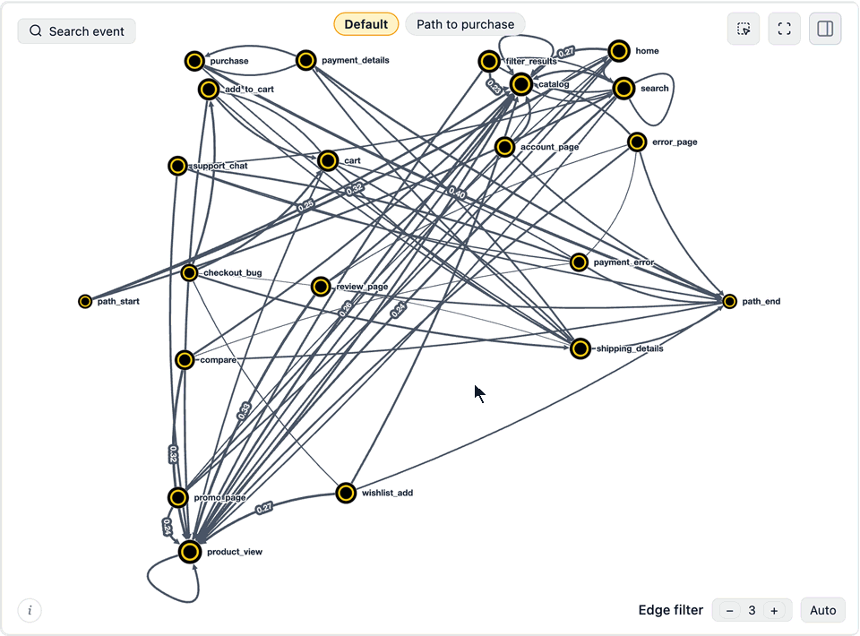
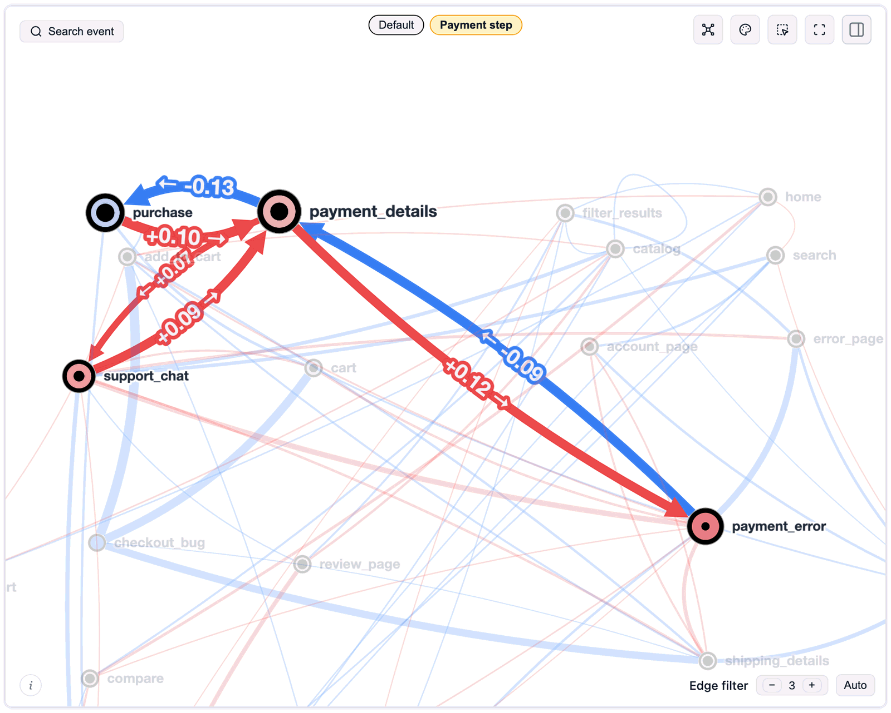
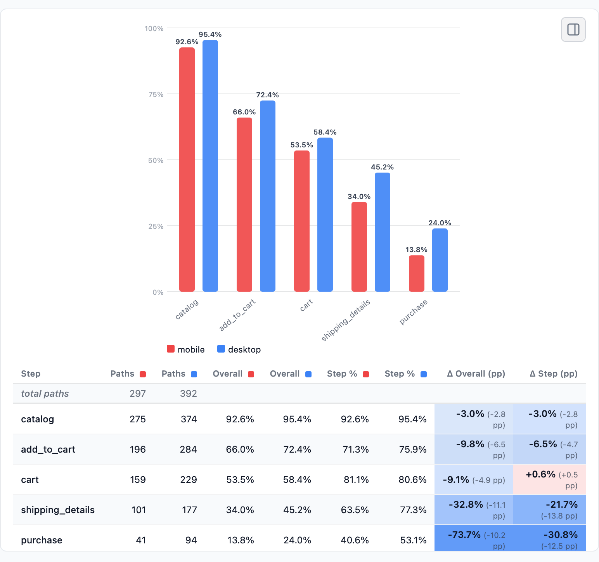
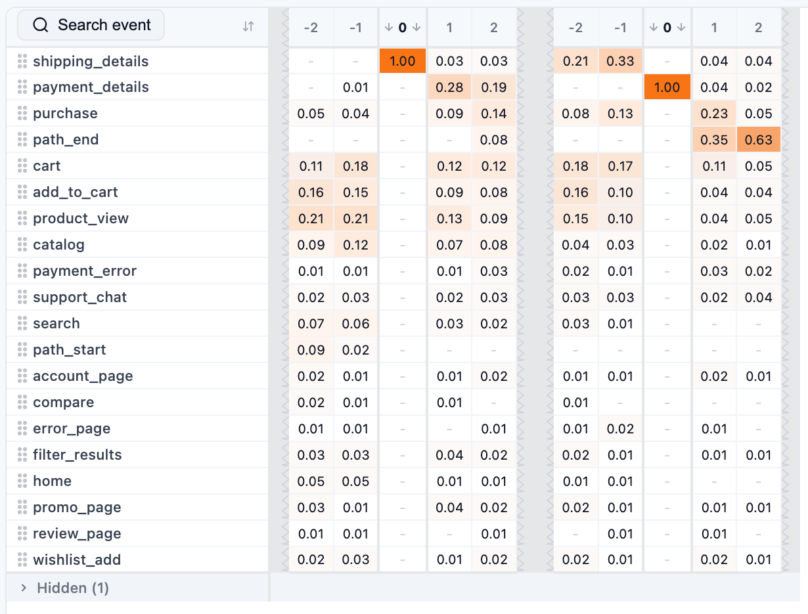
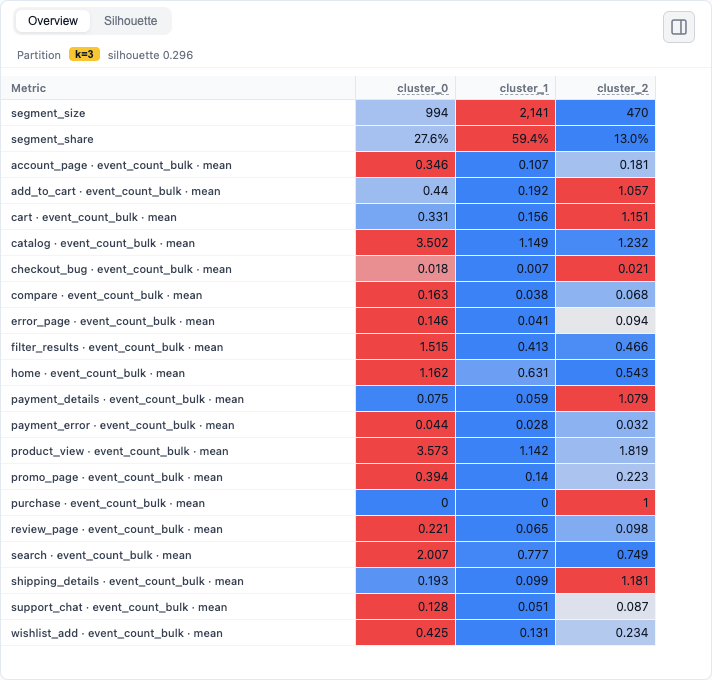
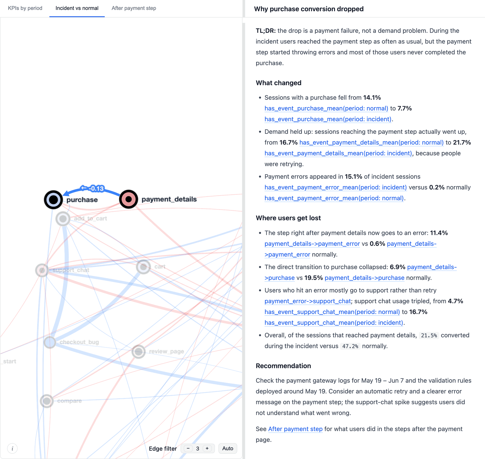

[](https://github.com/retentioneering/retentioneering-tools)
[](https://pypi.org/project/retentioneering/)
[](https://pypi.org/project/retentioneering/)
[](LICENSE)
[](https://pepy.tech/project/retentioneering)
[](https://discord.com/invite/hBnuQABEV2)
[](https://t.me/retentioneering_support)

**A code-first alternative to Amplitude or Mixpanel for user behavior analysis in Python, without uploading your data to a third-party service.**

<p align="center">
  
</p>

Retentioneering turns a raw event log into interactive maps of how users move through your product. You work in a Jupyter notebook, and the data stays on your machine.

- **[Interactive widgets](https://retentioneering.com/docs/widgets) built for user paths**: [transition graph](https://retentioneering.com/docs/widgets/transition-graph), [step matrix](https://retentioneering.com/docs/widgets/step-matrix), [step Sankey](https://retentioneering.com/docs/widgets/step-sankey), [funnel](https://retentioneering.com/docs/widgets/funnel), [cluster analysis](https://retentioneering.com/docs/widgets/cluster-analysis).
- **[Group comparison](https://retentioneering.com/docs/widgets#diff-mode)**: put two groups of paths side by side and the widgets highlight where their behavior differs.
- **[Path patterns](https://retentioneering.com/docs/path-patterns)**: a small regex-like language for finding, filtering and slicing sequences of events.
- **[Behavioral clustering](https://retentioneering.com/docs/widgets/cluster-analysis)**: split paths into types of behavior and see what makes each type different.
- **[AI agents](https://retentioneering.com/docs/agent-skills)**: Claude, Codex and other agents can run the analysis for you and hand back an interactive report.

<a href="https://colab.research.google.com/github/retentioneering/retentioneering-tools/blob/master/notebooks/retentioneering_5_tour.ipynb"></a> **Try it without installing anything:** the [tour notebook](https://colab.research.google.com/github/retentioneering/retentioneering-tools/blob/master/notebooks/retentioneering_5_tour.ipynb) runs in Google Colab on a bundled demo dataset.

## Install

```bash
pip install retentioneering
```

Python 3.10 to 3.13. Widgets render in Jupyter, JupyterLab, VS Code, Cursor and Google Colab. In a notebook cell, use `%pip install retentioneering`. More in the [installation guide](https://retentioneering.com/docs/installation).

## Quick start

All you need is a table with three columns: a user id, an event name and a timestamp. If your columns are named differently, pass a [schema](https://retentioneering.com/docs/eventstream#schema).

```python
import pandas as pd
import retentioneering as rete

df = pd.read_csv("events.csv")  # columns: user_id, event, timestamp
stream = rete.Eventstream(df)

stream.transition_graph()  # interactive graph of how users move between events
```

No data at hand? There's a synthetic e-commerce dataset in the box:

```python
ecom = rete.datasets.load_ecom()
ecom.funnel(steps=["catalog", "add_to_cart", "purchase"])
```

Every [data processor](https://retentioneering.com/docs/data-processors) returns a new `Eventstream`, so cleaning steps chain and the original stays untouched:

```python
clean = (
    stream
    .filter_events(drop={"event": ["bot_ping"]})
    .collapse_events(loops=True)
    .split_sessions(timeout="30m")
)
```

And every widget has a [headless twin](https://retentioneering.com/docs/widgets#headless-mode) that returns plain data, if you'd rather work with a DataFrame:

```python
matrix = stream.transition_graph_data(edge_weight="proba_out")  # DataFrame
```

The [quick start guide](https://retentioneering.com/docs/quick-start) walks through the rest.

## What you can do with it

The examples below run on the demo dataset, `stream = rete.datasets.load_ecom()`, so you can paste them into a notebook as is.

### Find out why a metric moved

Pick the dates when something went wrong, turn them into a [segment](https://retentioneering.com/docs/segments), and compare those paths with the usual ones in [diff mode](https://retentioneering.com/docs/widgets#diff-mode). Red edges happen more often during the drop, blue ones less often.

```python
drop = stream.add_segment("drop", time_range=("2024-05-19", "2024-06-07"))
drop.transition_graph(diff=["drop", "inside", "outside"])
```



Here the answer is on the screen: fewer users get from payment details to purchase, and a new route shows up, payment error followed by support chat.

The same comparison works for any two groups. Segments can be columns you already have (country, platform) or something you define on the fly with [`add_segment`](https://retentioneering.com/docs/data-processors/add-segment): users who reached checkout and never bought vs. those who did, a user's first week vs. the rest of their life, one acquisition channel vs. all others.

### Look inside A/B test results

A test finishes and the headline metric went up, down or nowhere. The next question is always why, and it comes back after every test you run. Treat the variant as a [segment](https://retentioneering.com/docs/segments) and compare the two groups step by step: which funnel step changed, which detours appeared, what the treatment group does instead of converting.

```python
stream = rete.Eventstream(df, {"segment_cols": ["variant"]})

ab = ["variant", "control", "treatment"]
stream.funnel(steps=["catalog", "add_to_cart", "cart", "shipping_details", "purchase"], diff=ab)
stream.transition_graph(diff=ab)
```



<sub>The demo dataset has no experiment in it, so the picture compares mobile and desktop. With a real test you'd put the variant column there.</sub>

There's no special A/B test machinery in the library. You get the same [funnel](https://retentioneering.com/docs/widgets/funnel), graph and step views, pointed at two groups of users, and you can rerun the same notebook every time a new test ends.

### Describe the paths you care about with patterns

[Path patterns](https://retentioneering.com/docs/path-patterns) look like regular expressions, with events instead of characters:

| Pattern | Matches |
|---|---|
| `cart->.*->purchase` | opened the cart and bought something later |
| `cart->[^shipping_details\|support_chat]*->path_end` | opened the cart, then left without starting checkout or asking support |
| `[search\|catalog]->product_view` | came to a product page from search or from the catalog |

The same syntax works across the library. Filter whole paths with [`filter_paths`](https://retentioneering.com/docs/data-processors/filter-paths):

```python
abandoned = stream.filter_paths(
    {"op": "=", "metric": "matches_pattern", "value": True,
     "metric_args": {"pattern": "cart->[^shipping_details|support_chat]*->path_end"}}
)
```

Cut each path down to the part you're interested in with [`truncate_paths`](https://retentioneering.com/docs/data-processors/truncate-paths), say from a failed payment to the support chat that followed it:

```python
after_error = stream.truncate_paths(
    start_anchor={"pattern": "payment_details->payment_error"},
    end_anchor={"pattern": "payment_error->[^payment_details]*->support_chat"},
)
```

Or zoom in on the neighborhood of each funnel step. [Step Matrix](https://retentioneering.com/docs/widgets/step-matrix) and [Step Sankey](https://retentioneering.com/docs/widgets/step-sankey) show a couple of steps before and after every anchor in the pattern and fold everything in between into a gap:

```python
stream.step_matrix(path_pattern="shipping_details->.*->payment_details", step_window=2)
```



### Split users into behavior types

[Cluster Analysis](https://retentioneering.com/docs/widgets/cluster-analysis) groups paths by what users did and shows what sets each group apart. Why did users churn? Cluster their paths and look at what each group actually did before leaving.

```python
stream.cluster_analysis(features=[{"metric": "length"}, {"metric": "event_count_bulk"}])
```



Clusters are built from [path metrics](https://retentioneering.com/docs/path-metrics). Once they make sense, [`add_clusters`](https://retentioneering.com/docs/data-processors/add-clusters) turns them into a segment column, and you can compare them like any other group.

### Let an AI agent do the analysis

There are two ways to hand the work to an agent:

- **[Agent skills](https://retentioneering.com/docs/agent-skills)**. Point Claude Code, Codex or Cursor at a skill from this repo and it writes and runs Retentioneering code against your files, following a tested workflow: inspect the log, pick a recipe, run it, check the result.
- **[MCP server](https://retentioneering.com/docs/mcp-server)** (beta). Start it from a notebook with `rete.mcp.serve(stream)`, connect your agent, and ask questions in plain words. The agent builds an interactive HTML report where every number links to the chart it came from, so you can check it instead of taking it on trust.



Agents that write code with the library can also read the docs directly: they're available as [`llms.txt`](https://retentioneering.com/llms.txt) and through a [documentation MCP server](https://retentioneering.com/docs/mcp-server#documentation-mcp-server).

## Documentation

Everything is at **[retentioneering.com/docs](https://retentioneering.com/docs/)**: guides, the full API reference, [recipes](https://retentioneering.com/docs/recipes) and live widget demos.

Coming from 3.x? Version 5 is a rewrite with a new API. See the [migration guide](https://retentioneering.com/docs/migration-from-3x) and the [changelog](CHANGELOG.md). The old engine is on the [`3.x` branch](https://github.com/retentioneering/retentioneering-tools/tree/3.x).

## Your data stays with you

The analysis runs where your notebook runs. There's no hosted service, and your event data never leaves your machine. The library does send anonymous usage statistics (which methods get called, never the data), and you can switch them off with one setting. Details are on the [tracking page](https://retentioneering.com/docs/tracking).

## Community and contributing

Questions and ideas are welcome on [Discord](https://discord.com/invite/hBnuQABEV2), in the [Telegram chat](https://t.me/retentioneering_support) and in [GitHub issues](https://github.com/retentioneering/retentioneering-tools/issues).

We'd love help with anything: bug reports, docs, examples, new widgets, new agent skills, analysis recipes. [CONTRIBUTING.md](CONTRIBUTING.md) explains how to set up the project locally. If you're not sure where to start, look for issues labelled [good first issue](https://github.com/retentioneering/retentioneering-tools/labels/good%20first%20issue). You can also reach us at retentioneering@gmail.com.

## License

Retentioneering-tools is licensed under [Apache 2.0](LICENSE), so you can use it, change it and build commercial products on top of it. Copyright Maxim Godzi, [Vladimir Kukushkin](https://www.linkedin.com/in/vladimir-kukushkin/) and Anatoly Zaytsev, with contributions from the Retentioneering community.

Retentioneering is also a community research lab working on analytics methods. Some other tools and services we build are commercial; they're described in [COMMERCIAL.md](COMMERCIAL.md). The Apache license covers the code in this repository and doesn't extend to the Retentioneering name and logo.
