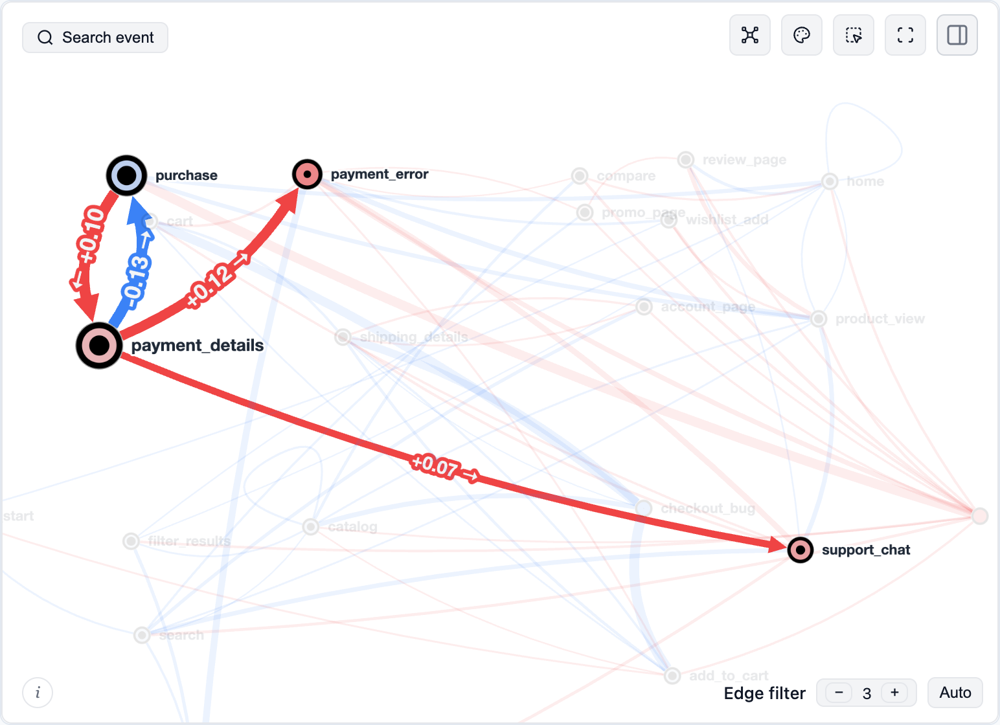
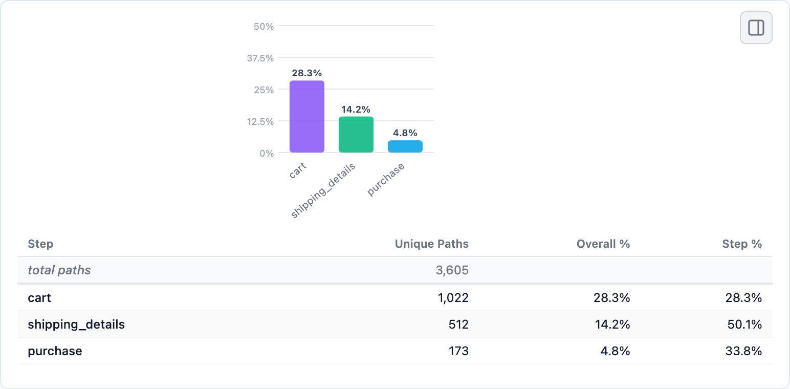
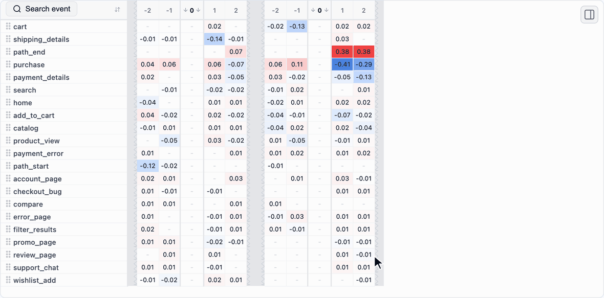
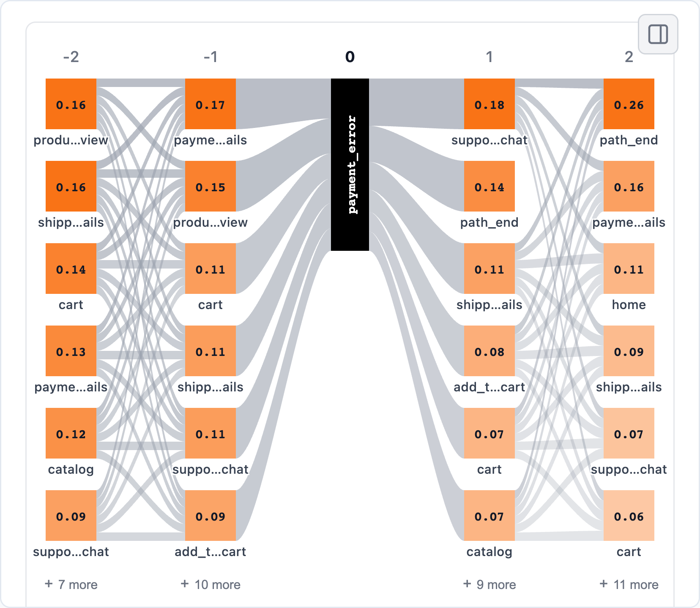
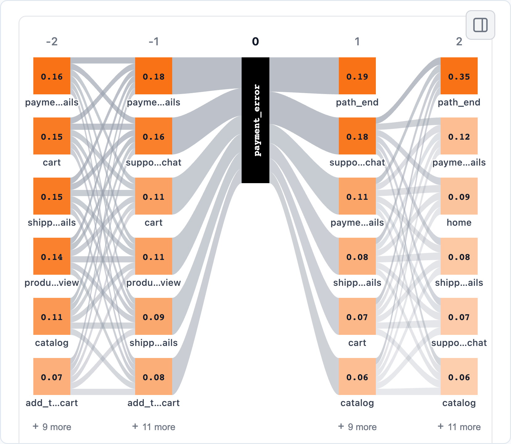
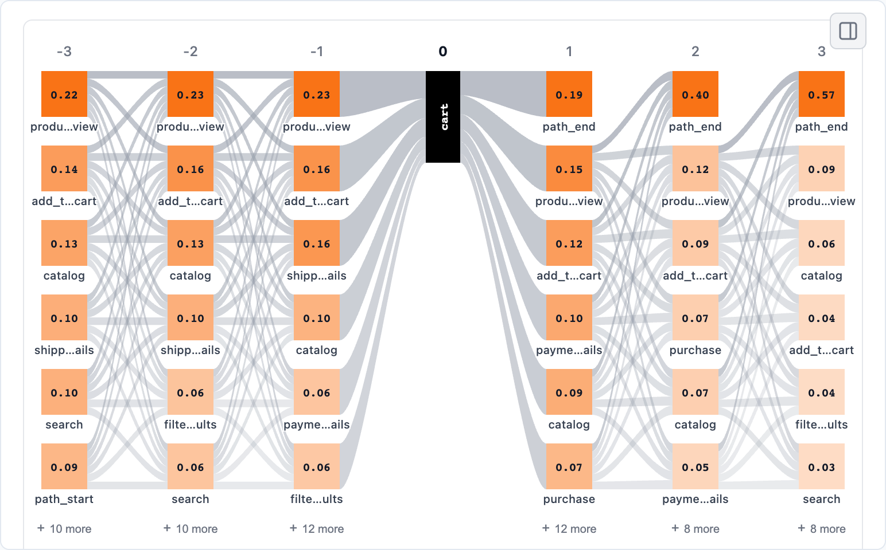
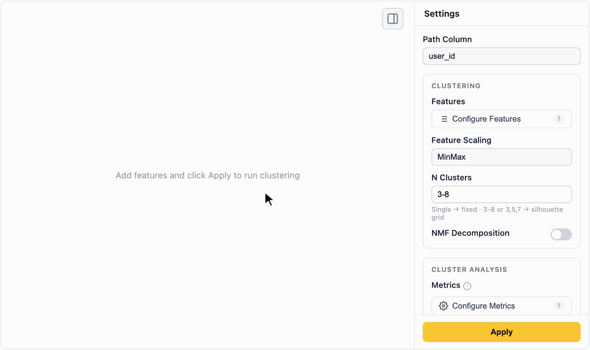
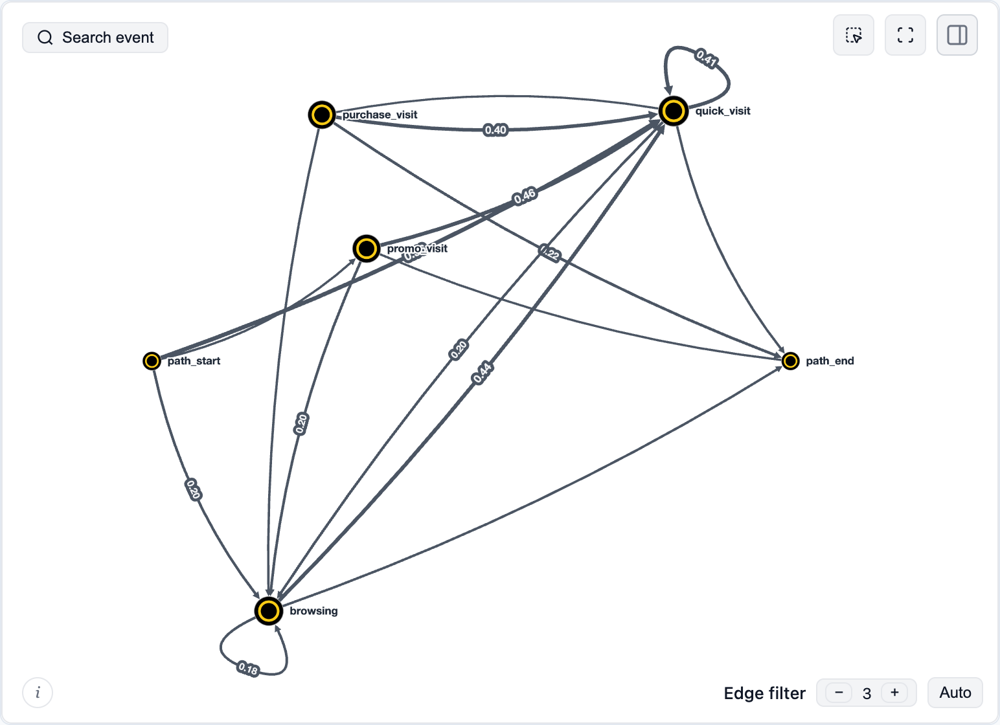
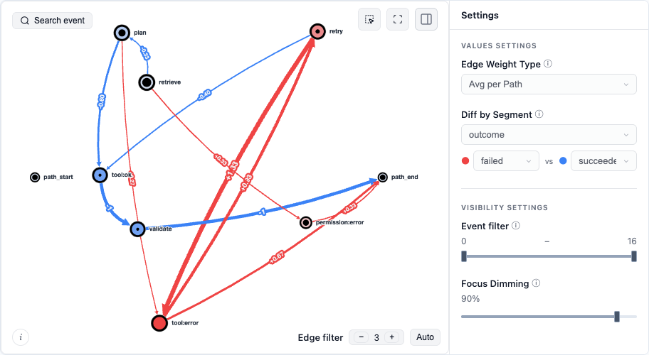
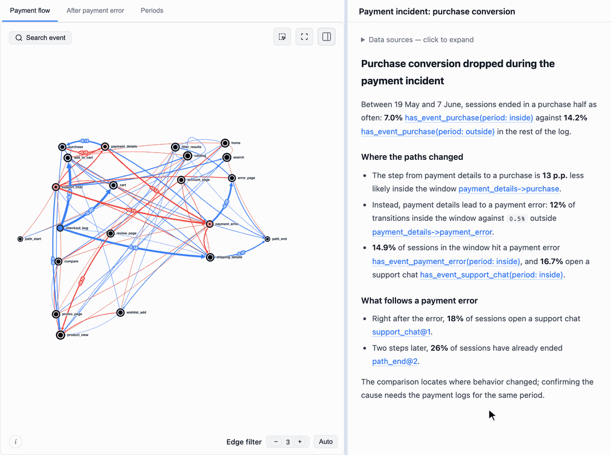

# Retentioneering

Retentioneering is an open-source Python library for **understanding user behavior from event logs**. Find where users get stuck, compare the paths different groups take, and discover patterns across clicks, sessions and repeat visits. Explore the data yourself or let an AI agent work with the same tools.

[](https://pypi.org/project/retentioneering/)
[](https://pypi.org/project/retentioneering/)
[](https://pepy.tech/project/retentioneering)
[](LICENSE)
[](https://discord.com/invite/hBnuQABEV2)
[](https://t.me/retentioneering_support)
[](https://colab.research.google.com/github/retentioneering/retentioneering-tools/blob/1b9a64440a6b57d7fe8d9910727cf34b78301bdf/notebooks/retentioneering_5_tour.ipynb)

[Run a demo notebook in Google Colab](https://colab.research.google.com/github/retentioneering/retentioneering-tools/blob/1b9a64440a6b57d7fe8d9910727cf34b78301bdf/notebooks/retentioneering_5_tour.ipynb) – no need to install the library locally, sample data included.

[Quick start](#quick-start) · [Use cases](#common-use-cases) · [Use an AI agent](#work-with-an-ai-agent) · [Docs](https://retentioneering.com/docs/)

<a href="https://retentioneering.com/docs/widgets/transition-graph"></a>

*A demo of the interactive features of the [transition graph](https://retentioneering.com/docs/widgets/transition-graph) widget. You can highlight a route, compare path groups, focus on the step you want to investigate, and explore incoming and outgoing transition probabilities in the ego view.*

## Is it for you?

Use Retentioneering when you have a question about *the sequence of actions* like these:

- A metric changed. Where did journeys change and move the metric?
- Users stop before reaching a goal. What do they do instead and how do successful paths differ?
- You want to understand engagement. What behavior types are represented, and how does usage evolve across visits?
- You need to investigate a flow. Where do checkout, onboarding, support or agent runs loop, branch or stall?

Bring an event-level export from your analytics platform, warehouse or application logs. All you need is a **user, session or case ID; an event name; and a timestamp**.

## Quick start

Python: 3.10 - 3.13.

Environment: Jupyter (Jupyter Notebook, JupyterLab, JupyterLab Desktop), VS Code, Cursor, Google Colab.

To install the library, run
```bash
pip install retentioneering
```
Within a notebook, use `%pip install retentioneering` instead. See the [installation guide](https://retentioneering.com/docs/installation) for the details.

To try out the library quickly, without [loading your own data](#bring-your-own-data), you can use a built-in e-commerce dataset:

```python
import retentioneering as rete

stream = rete.datasets.load_ecom()  # bundled synthetic store
stream.transition_graph()
```

## Common use cases

Below are a few examples of how you can apply retentioneering tools to approach common analytical problems on the [bundled e-commerce demo dataset](https://retentioneering.com/docs/eventstream#sample-dataset). The code chunks assume `stream = rete.datasets.load_ecom()`.

<details>
<summary>A key metric dropped. Where did journeys change and cause it?</summary>
<br>

Create a binary segment that [cuts each path at the boundaries of the affected period](https://retentioneering.com/docs/data-processors/add-segment#time_range--inside-vs-outside-a-window): its events inside the period are labelled `inside`, the rest `outside`, so one path can contribute to both parts. Then compare user behavior across these parts with the [transition graph widget](https://retentioneering.com/docs/widgets/transition-graph#diff-mode).

```python
periods = stream.add_segment("period", time_range=("2024-05-19", "2024-06-07"))
periods.transition_graph(diff=("period", "inside", "outside"))
```

<a href="https://retentioneering.com/docs/widgets/transition-graph#diff-mode"></a>

Click a node (e.g. `payment_details`) to inspect the routes that pass this node. With this comparison configuration, red means a higher next-step probability inside the period; blue means lower. This locates a behavioral difference to investigate.

Letting a path contribute to multiple levels of a segment gives more flexibility to diff mode: you can compare not only common attributes like mobile vs. desktop, acquisition channels, or experiment groups, but dynamic features as well: first session vs. the others, weekends vs. weekdays, etc.
</details>

<details>
<summary>Where do users leave the funnel and what do they do instead?</summary>
<br>

Count sessions that complete the steps in order – rather than whole user journeys (`path_col="session_id"`) – with the [funnel widget](https://retentioneering.com/docs/widgets/funnel):

```python
steps = ["cart", "shipping_details", "purchase"]
stream.funnel(steps=steps, path_col="session_id")
```

<a href="https://retentioneering.com/docs/widgets/funnel"></a>

Then compare sessions that stopped at the shipping stage of this funnel with those that completed it using the [step matrix widget](https://retentioneering.com/docs/widgets/step-matrix) in diff mode:

```python
(
    stream
        .add_segment("stage", funnel_events=steps, path_col="session_id")
        .step_matrix(
            path_pattern="cart->.*->shipping_details",
            step_window=2, path_col="session_id",
            diff=("stage", "shipping_details", "purchase"),
        )
)
```

<a href="https://retentioneering.com/docs/widgets/step-matrix"></a>

The `path_pattern="cart->.*->shipping_details"` argument of the step matrix breaks down the diagram into two parts: around `cart` and around `shipping_details`. You can inspect these surroundings and compare sessions that reached `shipping_details` but not `purchase` with those that completed the funnel.
</details>

<details>
<summary>What leads to, or follows, an error or another key event?</summary>
<br>

Instead of using traditional tree-like diagrams for path exploration, you can use [Step Sankey](https://retentioneering.com/docs/widgets/step-sankey), which shows the same numbers as a [Step Matrix](https://retentioneering.com/docs/widgets/step-matrix), drawn as flows. In this example, we align all the paths by the `payment_error` event and display the two steps on either side of it:

```python
stream.step_sankey(
    anchor="payment_error", step_window=2,
    path_col="session_id",
)
```

<a href="https://retentioneering.com/docs/widgets/step-sankey"></a>

A plain event name anchors each path on its first occurrence. An [anchor spec](https://retentioneering.com/docs/data-processors/truncate-paths#anchoring-on-a-sequence-not-just-an-event) chooses the position more precisely: which occurrence to use, which event of a [pattern](https://retentioneering.com/docs/path-patterns) to center on (`at`), or how far to shift from it (`offset`). For example, align sessions on their *last* payment error to see whether users recover after it or give up:

```python
stream.step_sankey(
    anchor={"pattern": "payment_error", "occurrence": "last"},
    step_window=2, path_col="session_id",
)
```

<a href="https://retentioneering.com/docs/widgets/step-sankey"></a>

After the last error, sessions end more often than after the first one: `path_end` takes 19% of the next step instead of 14%, and 35% two steps later instead of 26%.
</details>

<details>
<summary>Which sessions match a behavior I care about?</summary>
<br>

Find sessions that opened the cart, then ended without reaching shipping or support:

```python
abandoned = stream.filter_paths(
    {"metric": "matches_pattern", "op": "=", "value": True,
     "metric_args": {
         "pattern": "cart->[^shipping_details|support_chat]*->path_end"
     }},
    path_col="session_id",
)
abandoned.step_sankey(path_pattern="cart", path_col="session_id", step_window=3)
```

<a href="https://retentioneering.com/docs/widgets/step-sankey"></a>

The [filter_paths](https://retentioneering.com/docs/data-processors/filter-paths) data processor can filter paths according to a [path metric](https://retentioneering.com/docs/path-metrics) value, such as length, duration, event count, etc. In our case we use the `matches_pattern` metric that checks if a path matches the [regex-like pattern](https://retentioneering.com/docs/path-patterns) `cart->[^shipping_details|support_chat]*->path_end`.
</details>

<details open>
<summary>How does product usage differ between users? What behavioral patterns are represented?</summary>
<br>

To explore clusters interactively, start with a bare call of the [Cluster Analysis widget](https://retentioneering.com/docs/widgets/cluster-analysis) and set everything up in its sidebar:

```python
stream.cluster_analysis()
```

<a href="https://retentioneering.com/docs/widgets/cluster-analysis"></a>

Here users are clustered by [`event_count_bulk`](https://retentioneering.com/docs/path-metrics), which expands into one count per event type, over a grid of 3 to 8 clusters scored by the [silhouette metric](https://en.wikipedia.org/wiki/Silhouette_(clustering)). The heatmap compares mean metric values across clusters (blue for lower values, red for higher). Overview [metrics](https://retentioneering.com/docs/path-metrics) such as `length` or `in_segment_bulk` describe the clusters without changing the features used for clustering. Pick another partition on the **Silhouette** tab if you are not satisfied with the silhouette-best split. Once you find an optimal split, label the clusters in the header, click **Save Clusters** and save them as a [segment](https://retentioneering.com/docs/segments).

The same configuration can also be passed directly:

```python
stream.cluster_analysis(
    features=[{"metric": "event_count_bulk"}],
    method_args={"n_clusters": "3-8"},
    overview_metrics=[
        {"metric": "event_count_bulk"},
        {"metric": "length"},
        {"metric": "in_segment_bulk", "metric_args": {"segment_name": "acquisition_channel"}},
    ],
)
```

And the partition saved in the GIF above – four clusters, renamed – becomes a segment column with [add_clusters](https://retentioneering.com/docs/data-processors/add-clusters) and [rename_segment_levels](https://retentioneering.com/docs/data-processors/rename-segment-levels):

```python
user_types = (
    stream
        .add_clusters(
            "user_type", features=[{"metric": "event_count_bulk"}],
            method_args={"n_clusters": 4},
        )
        .rename_segment_levels("user_type", {
            "cluster_0": "browsers",
            "cluster_1": "researchers",
            "cluster_2": "buyers",
            "cluster_3": "light_users",
        })
)
```

Once clusters are saved as a segment, explore them like any other segment: compare them in the [diff mode](https://retentioneering.com/docs/widgets#diff-mode) of any widget or side by side in [Segment Overview](https://retentioneering.com/docs/widgets/segment-overview).
</details>

<details>
<summary>How does behavior change across visits?</summary>
<br>

[Cluster](https://retentioneering.com/docs/widgets/cluster-analysis) sessions according to behavioral types like this:

```python
stream.cluster_analysis(
    features=[{"metric": "event_count_bulk"}],
    method_args={"n_clusters": "4-8"},
    path_col="session_id"
)
```
Suppose 4 clusters look best. [add_clusters](https://retentioneering.com/docs/data-processors/add-clusters) reproduces that split as the `session_type` segment – the same result as Save Clusters in the widget. Then we can collapse sessions and treat them as single events with the [collapse_events](https://retentioneering.com/docs/data-processors/collapse-events) data processor and visualize the session flow with any widget, such as the transition graph:

```python
visits = (
    stream
        .add_clusters(
            "session_type", features=[{"metric": "event_count_bulk"}],
            method_args={"n_clusters": 4}, path_col="session_id",
        )
        .collapse_events(group_col="session_id", name={"col": "session_type"})
        .rename_events({
            "cluster_0": "browsing",
            "cluster_1": "quick_visit",
            "cluster_2": "purchase_visit",
            "cluster_3": "promo_visit"
        })
)
visits.transition_graph()
```

<a href="https://retentioneering.com/docs/data-processors/collapse-events"></a>
</details>

See [more analysis recipes](https://retentioneering.com/docs/recipes) in the docs.

## Bring your own data

The minimum input is a table with three columns – `user_id`, `event` and `timestamp`:

| user_id | event | timestamp |
|---|---|---|
| user_1 | signup | 2026-01-01 10:00:00 |
| user_1 | project_created | 2026-01-01 10:02:00 |
| user_1 | teammate_invited | 2026-01-01 10:05:00 |

Retentioneering uses the [Eventstream](https://retentioneering.com/docs/eventstream) class to store data and to provide access to all the library's methods.

```python
import pandas as pd
import retentioneering as rete

events = pd.read_csv("events.csv", parse_dates=["timestamp"])
stream = rete.Eventstream(events)
stream.transition_graph()
```

Use a [schema](https://retentioneering.com/docs/eventstream#schema) to map other column names, declare [path segments](https://retentioneering.com/docs/segments) or pre-existing sessions. Any dataset readable by pandas – such as CSV, Parquet or the result of a warehouse query – can become an eventstream.

<details>
<summary><b>Map an export from GA4, Amplitude, Mixpanel or Segment</b></summary>
<br>

These are starting points for common exports; check identity and timestamp fields in your actual data.

| Source | Path ID | Event | Timestamp |
|---|---|---|---|
| [GA4 BigQuery](https://support.google.com/analytics/answer/7029846) | `user_pseudo_id` | `event_name` | `event_timestamp` (microseconds) |
| [Amplitude](https://amplitude.com/docs/apis/analytics/export) | `user_id` or `amplitude_id` | `event_type` | `event_time` |
| [Mixpanel](https://docs.mixpanel.com/reference/raw-event-export) | `properties.distinct_id` | `event` | `properties.time` (Unix seconds) |
| Segment tracks | `user_id` or `anonymous_id` | `event` | `timestamp` |

Flatten nested properties and convert numeric timestamps to datetimes with the correct unit before loading. For example, after exporting the three GA4 fields above to a DataFrame named `ga4`:

```python
ga4["event_timestamp"] = pd.to_datetime(ga4["event_timestamp"], unit="us")
stream = rete.Eventstream(ga4, schema={
    "path_cols": ["user_pseudo_id"], "event_col": "event_name",
    "timestamp_col": "event_timestamp",
})
```

</details>

## Common analysis workflow

- **Prepare paths.** [Data processors](https://retentioneering.com/docs/data-processors) filter events or whole journeys, split sessions, collapse repeated actions and define segments. Each returns a new eventstream, so steps chain into a pipeline.
- **Explore.** Interactive [widgets](https://retentioneering.com/docs/widgets) show paths as graphs, step matrices, Sankey diagrams, funnels and clusters, and compare any two groups.
- **Build your own outputs.** Every widget has a [headless](https://retentioneering.com/docs/widgets#headless-mode) `*_data()` twin that returns the numbers behind the chart, for custom charts, reports and checks.
- **Share.** [`export_html()`](https://retentioneering.com/docs/widgets#exporting-to-html) saves a widget as a standalone interactive page that opens without Python.

## Explore agent runs, conversations and other event sequences

A path doesn't have to be a user journey. Treat each agent run as a path and its internal steps – tool calls, retries, errors, validations – as events, then use the same tools to see where runs loop, recover or fail, and how successful runs differ from failed ones. See the [agent-run example notebook](notebooks/agent_path_analysis.ipynb) ([open in Colab](https://colab.research.google.com/github/retentioneering/retentioneering-tools/blob/1b9a64440a6b57d7fe8d9910727cf34b78301bdf/notebooks/agent_path_analysis.ipynb)) for a synthetic walkthrough.

[](notebooks/agent_path_analysis.ipynb)

The same approach works for other processes: decide what one path is and which steps become its events. For example:

- Support conversations: a path is the sequence of message intents and handoffs within one conversation, e.g. `billing_question → bot_answer → rephrased_question → escalation → agent_answer → resolved`.
- Tickets: a path is the sequence of a ticket's status changes and reassignments, e.g. `opened → triaged → assigned:tier1 → waiting_for_customer → reassigned:tier2 → closed`.
- Learning sessions: a path is the sequence of lessons, attempts and their results within a study session or across a learner's whole course, e.g. `lesson_3 → quiz_3:fail → lesson_3_review → quiz_3:pass → lesson_4`.

## Work with an AI agent

Give your coding agent the [product-analytics skill](.agents/skills/retentioneering-product-analytics/SKILL.md) and an event file. The skill guides it through inspecting the log, choosing a recipe, running the analysis and checking the result. See [skill setup](https://retentioneering.com/docs/agent-skills) for supported workflows.

For example:

> Use Retentioneering to investigate where sessions in events.csv stall between cart and purchase. Check the schema and event order first. Compare sessions that purchased with those that stopped, keep non-purchasing sessions, and show the counts behind the main differences. Return the runnable analysis and an interactive HTML report.

**Prefer an MCP connection?** The [data MCP server](https://retentioneering.com/docs/mcp-server) (beta) exposes an Eventstream to a compatible agent from a local Python environment. Its report collects several tools in tabs and links every number in the text to the element it comes from – a graph edge, a step matrix cell or a segment overview cell:

<a href="https://retentioneering.com/docs/mcp-server"></a>

<details>
<summary><b>For AI assistants: current API and execution guidance</b></summary>
<br>

- Read the [current API index](https://retentioneering.com/llms.txt), [full text docs](https://retentioneering.com/llms-full.txt) or [documentation MCP guide](https://retentioneering.com/docs/mcp-server#documentation-mcp-server). Documentation access supplies reference material; data analysis also needs Python execution and access to the event file.
- This README uses **5.x**. Start with `import retentioneering as rete` and `rete.Eventstream(df, schema={...})`. Older 2.x/3.x examples use a different API.
- Choose and declare the path grain (`path_cols`); pass `path_col` to analyses when switching between users and sessions. Declare comparison columns in `segment_cols`.
- Use `transition_graph`, `step_matrix`, `step_sankey`, `funnel`, `segment_overview` and `cluster_analysis`. Their `*_data()` methods return computed results for inspection and automation; return types vary by tool.
- Graph, matrix, Sankey and funnel comparisons take `diff=("segment", "A", "B")` and show A minus B. Check group sizes, metric definitions and the corresponding data output.
- Processors return a new Eventstream. Assign the result, preserve the intended event order and population, and validate a complete sequence with a path pattern rather than inferring it from separate graph edges.
- Save and replay transformations with [Eventstream.recipe()](https://retentioneering.com/docs/eventstream#reproducing-an-eventstream). Keep findings separate from hypotheses about their causes.

</details>

## Telemetry

Anonymous usage telemetry is enabled by default. Sensitive data like event names, identifiers, path contents and parameter values is **never** sent; see [what is collected](https://retentioneering.com/docs/tracking). Set `RETENTIONEERING_NO_TRACK=1` before starting Python to disable it.

## Documentation and community

[Quick start](https://retentioneering.com/docs/quick-start) · [Eventstream](https://retentioneering.com/docs/eventstream) · [Widgets](https://retentioneering.com/docs/widgets) · [Data processors](https://retentioneering.com/docs/data-processors) · [Analysis recipes](https://retentioneering.com/docs/recipes)

Using a 3.x example? Version 5 rewrites the API. See the [migration guide](https://retentioneering.com/docs/migration-from-3x); legacy `Sequences`, `Cohorts`, `StatTests` and the visual Preprocessing Graph remain on the [3.x branch](https://github.com/retentioneering/retentioneering-tools/tree/3.x).

Bring a question, a useful recipe or a small reproducible example to [GitHub issues](https://github.com/retentioneering/retentioneering-tools/issues), [Discord](https://discord.com/invite/hBnuQABEV2) or [Telegram](https://t.me/retentioneering_support). Contributions to methods, widgets, examples and agent workflows are welcome – see [CONTRIBUTING.md](CONTRIBUTING.md).

*Apps are better with math. Join us!*

## License and commercial model

Retentioneering-tools is open-source software licensed under the Apache License, Version 2.0.

Retentioneering is a community research laboratory dedicated to developing new analytics methodology and open-source tools.

Copyright retentioneering-tools v.5.0 [Maxim Godzi](https://www.linkedin.com/in/godsie/), [Vladimir Kukushkin](https://www.linkedin.com/in/vladimir-kukushkin/) and [Anatoly Zaytsev](https://www.linkedin.com/in/anatoly-zaytsev/). Updates may include software developed by the Retentioneering community.

You are free to use, modify, distribute, and build commercial products with Retentioneering-tools, subject to the terms of the Apache-2.0 license.

Other Retentioneering libraries, packages and managed execution services, enterprise integrations, premium diagnostic workflows, and hosted collaboration features are separate proprietary products and are governed by their respective commercial terms. Additional details are provided in [COMMERCIAL.md](COMMERCIAL.md).

The Apache-2.0 license applies only to the source code and assets distributed in this repository. It does not grant rights to use the Retentioneering name, logo, trademarks, hosted services, proprietary cloud infrastructure, or commercial content that is not distributed in this repository.

We welcome contributions from individuals and organizations. Contributions to Retentioneering-tools are accepted under the contribution terms described in [CONTRIBUTING.md](CONTRIBUTING.md#contribution-terms).

Our goal is to keep the core analytical language and ecosystem open, extensible, and useful for independent analysts, researchers, startups, and enterprise teams, while funding long-term maintenance through optional commercial products and services.
