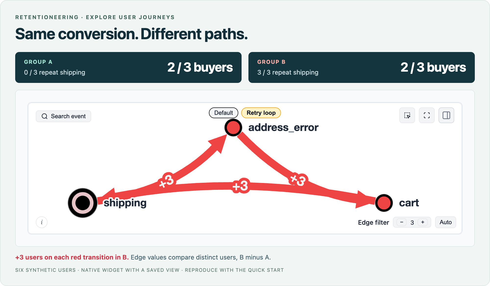

# Retentioneering

**See what happens between the steps.**

Retentioneering is an open-source Python library for **exploring user journeys from event logs**. Find loops and detours, compare groups, and follow behavior from individual clicks to sessions and longer journeys.

Use it when a funnel or dashboard leaves you with another question: *What did people actually do along the way?* Start with an event-level export from your existing analytics stack and investigate it in a notebook or Python script.

[Try it](#try-it) · [Use your own data](#use-your-own-data) · [Analysis recipes](https://retentioneering.com/docs/recipes) · [AI agents](#work-with-an-ai-agent) · [Documentation](https://retentioneering.com/docs/)



*Same conversion, different paths. The graph is focused on the retry loop and compares distinct users per transition, B minus A. This is a six-user teaching example; the code below reproduces the data and comparison.*

## Try it

Requires **Python 3.10+**.

```bash
pip install retentioneering
```

In a notebook, use `%pip install retentioneering`. See [installation help](https://retentioneering.com/docs/installation) for notebook setup.

No dataset needed. Paste this into a notebook or save it as a Python script:

```python
import pandas as pd
import retentioneering as rete

paths = {
    "A1": "checkout shipping purchase",
    "A2": "checkout shipping purchase",
    "A3": "checkout shipping",
    "B1": "checkout shipping address_error cart shipping purchase",
    "B2": "checkout shipping address_error cart shipping purchase",
    "B3": "checkout shipping address_error cart shipping",
}
events = pd.DataFrame([
    {"user_id": user, "event": event, "variant": user[0],
     "timestamp": pd.Timestamp("2026-01-01") + pd.Timedelta(seconds=step)}
    for user, path in paths.items()
    for step, event in enumerate(path.split())
])

stream = rete.Eventstream(events, schema={"segment_cols": ["variant"]})
graph = stream.transition_graph(
    diff=("variant", "B", "A"), edge_weight="unique_paths"
)
graph.export_html("checkout.html")
graph  # Displays the interactive graph in a notebook
```

**Look for the retry loop:** `shipping → address_error → cart → shipping`. Both groups have two buyers out of three users, but all three B users take the detour. Red edges show transitions used by more B users; blue edges show transitions used by more A users.

Running a script? Open **`checkout.html`** in your browser. It includes interactive viewing controls and works without a notebook or network connection. New data or calculations require Python.

The same code is available in [examples/readme_quickstart.py](examples/readme_quickstart.py).

### Ask the next question

Align both groups on their first shipping event to inspect the next steps:

```python
stream.step_matrix(
    anchor="shipping", max_steps=4, diff=("variant", "B", "A")
)
```

Count users who followed the complete loop, rather than inferring a route from separate graph edges:

```python
loops = stream.get_metrics([
    {"metric": "matches_pattern",
     "metric_args": {"pattern": "shipping->address_error->cart->shipping"}}
])
print(int(loops.iloc[:, 0].sum()))  # 3 users out of 6
```

## Bring a question, choose a view

| Your question | Start here |
|---|---|
| **Conversion dropped after a release. Where did the paths change?** | Compare groups with a [Transition Graph](https://retentioneering.com/docs/widgets/transition-graph), then inspect the affected step. |
| **What happens just before an error or after a key action?** | Align paths on that event with a [Step Matrix](https://retentioneering.com/docs/widgets/step-matrix). |
| **Which users complete these steps in order?** | Build a [Funnel](https://retentioneering.com/docs/widgets/funnel); use [conversion within a time window](https://retentioneering.com/docs/eventstream) when timing matters. |
| **Where do users get stuck during onboarding?** | Define activated and stalled [segments](https://retentioneering.com/docs/segments), compare paths, and check specific patterns. |
| **Are there different ways to use the product?** | Explore path features with [Cluster Analysis](https://retentioneering.com/docs/widgets/cluster-analysis), then inspect what distinguishes the groups. |
| **How does behavior change across visits?** | Split sessions, turn visits into events, and explore their sequence with [Step Sankey](https://retentioneering.com/docs/widgets/step-sankey). |

These views help locate differences in observed behavior and formulate hypotheses. Establishing the effect of a product change requires an appropriate experiment or causal analysis.

## Use your own data

Start with a pandas DataFrame containing **a path identifier, an event name and a timestamp**. With the default column names:

```python
import pandas as pd
import retentioneering as rete

events = pd.read_csv("events.csv", parse_dates=["timestamp"])
stream = rete.Eventstream(events)  # user_id, event, timestamp
stream.transition_graph()
```

Load Parquet or a warehouse export through pandas in the same way. Use a [schema](https://retentioneering.com/docs/eventstream) to map other column names, declare session IDs or add segments such as platform and app version.

**Choose what one path means.** Analyze a person across visits, one session, or another well-defined sequence. Use [sessionization](https://retentioneering.com/docs/data-processors/split-sessions) when visits need to be derived, and `path_col` to select a declared path identifier. Choose comparable observation windows before comparing groups.

## Keep the investigation in one workflow

- **Prepare event sequences.** Filter complete paths, cut around meaningful events, group actions, split sessions or build daily activity states. Processors return a new `Eventstream`, preserving the original.
- **Get numbers as well as charts.** Use headless `*_data()` methods for tables, checks and automated analysis.
- **Save the transformations.** Replay a processor `recipe()` with the original schema and compatible input data.
- **Share the result.** Export interactive HTML snapshots for colleagues who do not run Python.

For a log with `shipping` and `purchase` events, inspect checkout while keeping users who never purchased:

```python
checkout = stream.truncate_paths("shipping", ["purchase", "path_end"])
counts = checkout.funnel_data(steps=["shipping", "purchase"])
```

The `path_end` fallback retains unfinished paths. See [analysis recipes](https://retentioneering.com/docs/recipes) for comparisons, time windows and reproducible workflows.

## Work with an AI agent

Use the same library through an agent that can run Python, or connect a compatible client to the **[MCP data server](https://retentioneering.com/docs/mcp-server)** (beta). The repository also provides **[agent skills](https://retentioneering.com/docs/agent-skills)** for data inspection, analysis and validation.

A useful starting request:

> Compare checkout paths before and after this release. Use sessions as the unit, keep sessions without a purchase, and show the counts behind any differences.

The [documentation MCP server](https://retentioneering.com/docs/mcp-server#documentation-mcp-server) provides reference material; analyzing your data also requires an execution environment and access to the event log.

## Run where your data lives

The DuckDB-backed analysis runs in your Python environment; no hosted Retentioneering service is required. Disable anonymous usage telemetry by setting `RETENTIONEERING_NO_TRACK=1` before starting Python. See [tracking details](https://retentioneering.com/docs/tracking). An external agent may receive tool results according to its configuration.

## Using a 3.x example?

This README targets **5.x**. APIs and feature coverage differ from 3.x: legacy `Sequences`, `Cohorts`, `StatTests` and the visual Preprocessing Graph are not part of the current API. Check the [migration guide](https://retentioneering.com/docs/migration-from-3x) before copying older examples. The original implementations remain on the [`3.x` branch](https://github.com/retentioneering/retentioneering-tools/tree/3.x).

## Contribute

Found a useful pattern, a confusing result or a bug? Share a small reproducible example in an [issue](https://github.com/retentioneering/retentioneering-tools/issues). Contributions to analytical methods, widgets, recipes and documentation are welcome—see [CONTRIBUTING.md](CONTRIBUTING.md).

Join the community on [Discord](https://discord.com/invite/hBnuQABEV2) or [Telegram](https://t.me/retentioneering_support).

## License and commercial model

Retentioneering-tools is open-source software licensed under the Apache License, Version 2.0.

Retentioneering is a community research laboratory dedicated to developing new analytics methodology and
opensource tools.

Copyright retentioneering-tools v.5.0 Maxim Godzi, [Vladimir Kukushkin](https://www.linkedin.com/in/vladimir-kukushkin/) and Anatoly Zaytsev. Updates may include software developed by the Retentioneering community.

You are free to use, modify, distribute, and build commercial products with Retentioneering-tools, subject to the terms of the Apache-2.0 license.

Other Retentioneering libraries, packages and managed execution services, enterprise integrations, premium diagnostic workflows, hosted collaboration features are separate proprietary products and are governed by their respective commercial terms. Additional details provided in [COMMERCIAL.md](COMMERCIAL.md).

The Apache-2.0 license applies only to the source code and assets distributed in this repository. It does not grant rights to use the Retentioneering name, logo, trademarks, hosted services, proprietary cloud infrastructure, or commercial content that is not distributed in this repository.

We welcome contributions from individuals and organizations. Contributions to Retentioneering-tools are accepted under the contribution terms described in [CONTRIBUTING.md](CONTRIBUTING.md).

Our goal is to keep the core analytical language and ecosystem open, extensible, and useful for independent analysts, researchers, startups, and enterprise teams, while funding long-term maintenance through optional commercial products and services.
