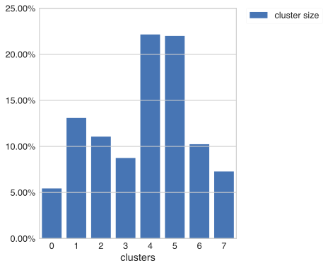

Users behavior clustering
~~~~~~~~~~~~~~~~~~~~~~~~~

Behavior clustering intro
=========================

Basic example
=============

This notebook can be found
`here <https://github.com/retentioneering/retentioneering-tools/blob/fix_normalization_funcs/examples/clusters_tutorial.ipynb>`__.

We will use sample user dataset to illustrate how behavior clustering works. Let's first
import retentioneering, import sample dataset and update config:

.. code:: ipython3

    import retentioneering

    # load sample data
    from retentioneering import datasets
    data = datasets.load_simple_shop()

    # update config to specify column names
    retentioneering.config.update({
        'event_col':'event',
        'event_time_col':'timestamp',
        'index_col': 'client_id'
    })

We can now use get_clusters method to split users on groups based on how similar is their behavior:

.. code:: ipython3

    data.rete.get_clusters(method='kmeans',
                           n_clusters=8,
                           ngram_range=(1,2));

Under the hood each user trajectory (sequence of event names) got transformed to numeric vector.
In the example above we used 'ftidf' vectorization (default vectorizer), where
vocaburary is sequences of events from 1 to 2 (parameter ngram_range), meaning that we count
individual events up to sequnces of 2 (bi-grams).

Parameter n_clusters corresponds to the number of desired clusters. Parameter method - type of clusterization
algorithm to use (currently support 'kmeans' and 'gmm').

Result of the running method above is assigned to a new attribute cluster_mapping, which is a
dictionary containing user_id's for each cluster:

.. code:: ipython3

    data.rete.cluster_mapping

.. parsed-literal::

    {0: [7584012,
      7901023,
      10847418,
      12133064,
      15882438,
      20104222,
    ...,
    1: [463458,
      1475907,
      10007545,
      10768877,
      10769994,

Now, if we need to obtain all user_id's from a specific cluster, it can be done very easily using
cluster_mapping dictionary. For example:

.. code:: ipython3

    clus_2 = data.rete.cluster_mapping[2]

here, clus_2 will contain all user_id's of users from cluster 2.

Visualizing results
===================

Very often it is useful to have a high-level overview of the results of clusterization
immediately after clusterization was done. Clusters statistics can be shown with the
clusterization by including plot_type parameter:

.. code:: ipython3

    data.rete.get_clusters(method='kmeans',
                           n_clusters=8,
                           ngram_range=(1,2),
                           plot_type='cluster_bar');

By default it shows the size of each cluster. We can add convertion to any specified event
to the clusters statistics using parameter targets, where we can specify target events.
High-level overview bar plot will now include convertion rate (% of users within the cluster
who have specified event at least once) for specified target:

.. code:: ipython3

    data.rete.get_clusters(method='kmeans',
                           n_clusters=8,
                           ngram_range=(1,2),
                           plot_type='cluster_bar',
                           targets=['payment_done']);

.. image:: _static/clustering/clustering_1.svg

Parameter targets can contain any number of events. For each added event, corresponding
convertion rate will be included to cluster overview bar plot. This is very useful when
you need to get a quick intuition about the resulting clusters:

.. code:: ipython3

    data.rete.get_clusters(method='kmeans',
                           n_clusters=8,
                           ngram_range=(1,2),
                           plot_type='cluster_bar',
                           targets=['payment_done','cart']);

.. image:: _static/clustering/clustering_2.svg

In example above we can see that clusters 0 and 7 have relatively high convertion rates to purchase
comparing to other clusters (CR: 'payment_done'). Interestingly, cluster 4 has very high convertion
to visit 'cart' (same as clusters 0 and 7) but don't have any convertions to 'payment_done'. This
must be cluster of users who reach the cart but get lost somewhere between cart and payment_done.
This way wwe can immediately start buiding our intuition about resulting clusters.

Exploring individual clusters
=============================

After clusterization is done we can explore individual clusters using full arsenal of
retentioneering tools. Function filter_cluster can be used to isolate individual dataset
for a given cluster number:

.. code:: ipython3

    clus_4 = data.rete.filter_cluster(4)

now, clus_4 is regular pandas dataframe containig only users from cluster 4. Since it is
regular pandas dataframe we can directly apply rete tools such as plot_graph or step_matrix to
explore it:

.. code:: ipython3

    clus_4.rete.plot_graph(thresh=0.1,
                           weight_col='client_id',
                           targets = {'lost':'red',
                                      'payment_done':'green'})

.. raw:: html

            <iframe
                width="700"
                height="600"
                src="_static/clustering/index_0.html"
                frameborder="0"
                allowfullscreen
            ></iframe>

|
We can see that this cluster #4 consists of users who explore catalog, products 1 and 2, then
reach the 'cart', but lost after the cart. To see how users in cluster 4 get to the cart we can
plot step_matrix centered around cart:

.. code:: ipython3

    clus_4.rete.step_matrix(max_steps=12,
                            centered={'event': 'cart',
                                      'left_gap': 4,
                                      'occurrence': 1});

.. image:: _static/clustering/clustering_3.svg

Other clusters can be explored in a similar way. Note, that dataframe containing multiple
clusters can be extracted by passing a list of cluster numbers to filter_cluster() function.
For example, if we would like to obtain dataset only containing users from clusters 0 and 7
for subsequent analysis, we can simply do:

.. code:: ipython3

    clus_0_7 = data.rete.filter_cluster([0,7])

