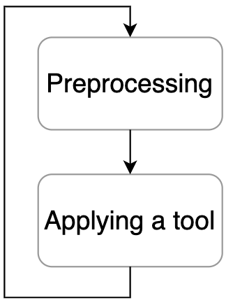
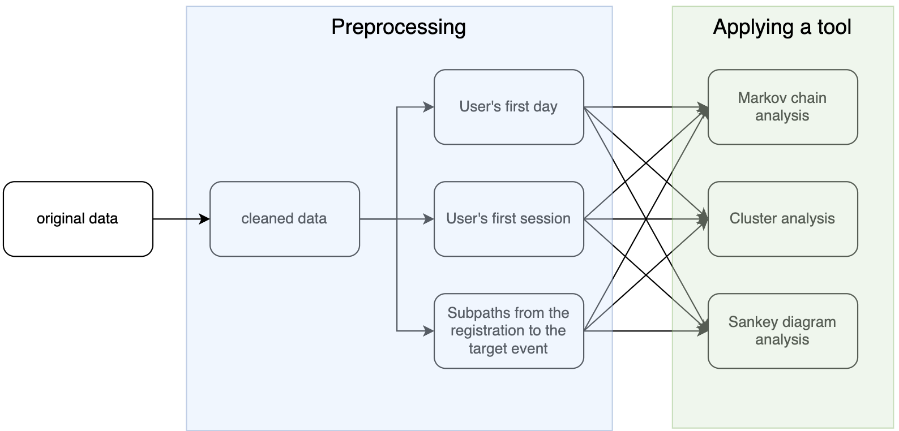
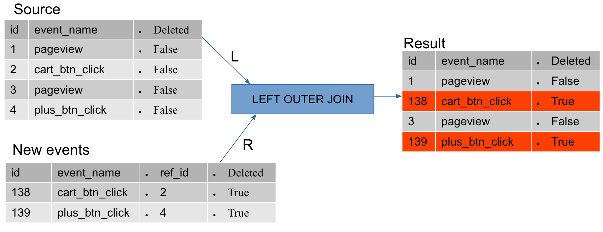
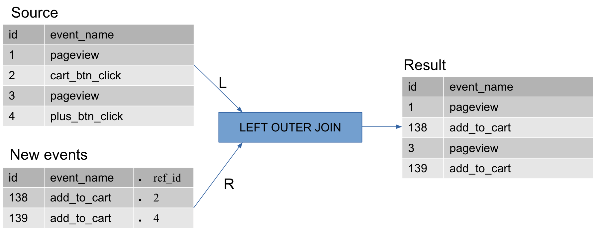

.. raw:: html

    

.. role:: red

Eventstream class overview
==========================

Why Eventstream
---------------

Let’s start with an abstract model of a typical analytical research.
According to this model, each research consists of two basic steps.

- | **Preprocessing**. I.e. preparing the data to be analyzed (cleaning, reformatting the data, etc).

- **Applying an analytical tool to prepared data**. By tool we mean a wide range of analytical techniques (fitting a statistical model, making a visualization, etc).

These steps are repeated multiple times throughout the research. Roughly
speaking, data analysts repeatedly tweak the data in some way and look
what this leads to. The reason of this fact is that production data has
often complex structure, it’s biased. Particular problems appear as long
as you conduct your research, and usually you reveal them after an
analytical tool you’ve applied to the imperfect data provides
unreliable, controversial or even explicitly incorrect results.

    Fig. 1. A simplified schema of a typical analytical research

Assume for simplicity, that the goal of a research is to explore users
behavior in scope of their first steps in the product. Since “first
steps” is poorly defined, a data analyst might consider multiple
possible cases, e.g.:

- User’s first day,

- User’s first session,

- A sub-path from user’s registration to a target event (like completing an onboarding tour).

Each of these cases generates a subset of the original data which should
be analyzed. Also, we assume that a data cleaning step should precede
these splitting logic.

By “to explore users behavior” one could mean applying different
techniques, such as analyzing Markov chain model, performing cluster
analysis, analyzing a step-wise Sankey diagram. As a result, we obtain 9
different analytical cases (see Fig. 2).

    Fig. 2. An example of an analytical research with branching logic.

Supporting all the corresponding code in a single Jupyter notebook is
often neither convenient nor resource-efficient. Indeed, you have to
keep all the data samples in the notebook’s memory, you have to control
the order of executing notebook’s cells, and you need to organize the
code so it could be easy-to-read. Things become even worse when a data
analyst needs to share this notebook for maintenance with another
colleague: diving into the sheets of the code might be tough for a
newcomer.

All the problems described above inclined us to create a solution which
could treat a clickstream in an efficient way.

Introducing Eventstream class
-----------------------------

``Eventstream`` is a core class of the library. Essentially, it
represents a container for the original clickstream which keeps not only
the data itself but all the manipulations made with it throughout the
analysis. Hereafter we refer to ``eventstream`` term associating it with
either the original clickstream data or some state of the transformed
clickstream.

The role ``Eventstream`` plays is 3-folded: data management,
preprocessing, and applying analytical tools. \* Data management.
``Eventstream`` allows you to easily switch to any state of the original
clickstream which you passed while conducting the research in the way
similar to switching a state in a file repository. \* Preprocessing.
``Eventstream`` provides a wide range of methods which wrangle
clickstream data in many useful ways. \* Applying analytical tools.
Having a particular prepared state of an eventstream, you can apply an
analytical tool by calling an appropriate method.

We assume that the original clickstream which generates an
``Eventstream`` class instance is naturally represented by a
``pandas.DataFrame`` and consisted of three columns: user_id, event,
timestamp.

Preprocessing
-------------

As it was mentioned above, we define ``preprocessing`` as any data
manipulations preceding applying a core analytical tool. The process is
consisted of *atomic operations* which form a *preprocessing graph*.

Atomic operations
~~~~~~~~~~~~~~~~~

On a basic level, there are 3 possible atomic operations one could apply
to an eventstream: insert, delete, edit.

Insert operations are associated with adding so called *synthetic
events*. These events aim to bring some additional information about a
current state of a user at her particular path step. For example, it’d
be useful to add explicit ``path_start`` and ``path_end`` events in the
beginning and in the end of each user’s path correspondingly, or you
might want to break down the paths into sessions by adding
``session_start`` and ``session_end`` events explicitly.

Delete operations are used when you need to remove some
useless/rubbish/technical events from the eventstream, or remove some
paths entirely or partially.

Edit operations are useful when you need to rename or group some events.
In many products user events have their natural taxonomy, so you might
want to group them at some levels in order to provide different levels
of granularity.

All these operations might be associated with ``LEFT OUTER JOIN``
operator. Why ``LEFT OUTER JOIN``? i) It guarantees that the keys from
the left table are kept safe and ii) adds some new keys from the right
table which are not represented in the left table. These properties
allow us to manage all the preprocessing calculations keeping the
original events intact. And this fundamental property, in turn, makes
switching between evenstream states possible. The exact way how we do
this is described in the next section.

:red:`TODO: Make nicer images`

.. |atomic_insert| image:: _static/eventstream/atomic_insert.png

+---------+-------------------+
| Insert  +  |atomic_insert|  +
+---------+-------------------+
| Delete  +  |atomic_delete|  +
+---------+-------------------+
| Edit    +  |atomic_edit|    +
+---------+-------------------+

Preprocessing graph
~~~~~~~~~~~~~~~~~~~

All the atomic operations comprising preprocessing data manipulations
form a directed graph which we call ``preprocessing graph``. Strictly
speaking, the graph is not necessarily a tree since nodes merging
operations are also possible. :red:`TODO: Refer to grouping operators.` But in
most cases calculations graphs are trees. The graph is implemented as
``PGraph`` class, and its nodes are instances of ``EventNode`` class.

Please note that when we construct such a graph we don’t run
calculations. Preprocessing graph just profiles the calculation schema
defining what exactly and when exactly should be calculated. In order to
run a calculation directly, you should choose a node you consider as an
endpoint and run the calculation from the root node to the endpoint
explicitly by calling ``combine`` method(:red:`TODO: See combine method`). This
method returns you exact eventstream state (e.g. the data) related to a
given preprocessing node.

Again, we highlight that having an eventstream at some preprocessing
point doesn’t affect the original data. In particular, the records you
see removed are just marked as removed and invisible for you at this
state. The renamed or grouped events are shown as renamed, but their
predecessors are kept physically untouched. Immutability is a core
property of eventstream concept.

Data processors
~~~~~~~~~~~~~~~

``DataProcessor`` is an abstract class for building the nodes of
preprocessing graph – ``EventNodes`` instances, and any child class is
called a *data processor*. Constructing a graph, actually, is a process
of creating data processor nodes and linking them according to
calculation logic. Each data processor has a supplementary class (as a
child of abstract ``ParamsModel`` class) containing the corresponding
data processor parameters. Consider ``SplitSessions`` data processor. It
has a supplementary class ``SplitSessionsParams`` which contains data
processor’s parameters, e.g. ``session_cutoff`` parameter indicates the
timeout between two sequential events when we mark the end of one
session and the beginning of the next one.

Here’s an example how to create a simple preprocessing graph consisting
on a two nodes ``StartEndEvents`` and ``SplitSessions``.
``StartEndEvents`` has no parameters, so we pass an empty dictionary
explicitly. For ``SplitSessions`` we use ``session_cutoff=(1, 'h')``
threshold indicating that we cut a session when the distance between two
consequent event is greater than the given threshold.

.. code:: ipython3

    from retentioneering.graph.p_graph import PGraph, EventsNode
    from retentioneering.data_processors_lib import SplitSessions, SplitSessionsParams
    from retentioneering.data_processors_lib import StartEndEvents, StartEndParams

    # creating single nodes
    node1 = EventsNode(StartEndEvents(params=StartEndEventsParams(**{})))
    node2 = EventsNode(SplitSessions(params=SplitSessionsParams(session_cutoff=(1, 'h')))

    # creating a preprocessing graph and linking the nodes
    pgraph = PGraph(source_stream=stream)
    pgraph.add_node(node=node1, parents=[pgraph.root])
    pgraph.add_node(node=node2, parents=[node1])

    # run the calculation from the root node to SplitSessions node
    processed_stream = pgraph.combine(node=node2)

TODO: Introduce all the data processors

Eventstream preprocessing methods
~~~~~~~~~~~~~~~~~~~~~~~~~~~~~~~~~

In many real-world scenarios preprocessing graph has simple linear
structure. For such cases constructing a preprocessing graph is
excessive, and this is where special eventstream *helpers* will be
handy. Each developed data processor has a linked ``Eventstream`` method
which takes ``Eventstream`` instance as input and returns a modified
eventstream. These methods are: :red:`TODO: Introduce all the helpers`

So the usage of helpers makes preprocessing extremely simple for coding:

.. code:: ipython3

    processed_stream = stream \
        .add_start_end() \
        .split_sessions(session_cutoff=(1, 'h'))

Preprocessing GUI
~~~~~~~~~~~~~~~~~

:red:`TODO: Describe GUI usage.`

Custom data processors
~~~~~~~~~~~~~~~~~~~~~~

:red:`TODO:`

Tools application
------------------

Retentioneering tools are designed as ``Eventstream`` class methods. So
before calling such a method we need to be sure that an ``Evenstream``
class instance is ready for applying a tool, and all the needed
preprocessing steps are completed.

We have the following tools in our arsenal:

- ``Eventstream.transition_graph``

- ``Eventstream.step_matrix``

- ``Eventstream.step_sankey``

- ``Eventstream.clusters``

- ``Eventstream.funnel``

- ``Eventstream.cohorts``

- ``Eventstream.compare``
