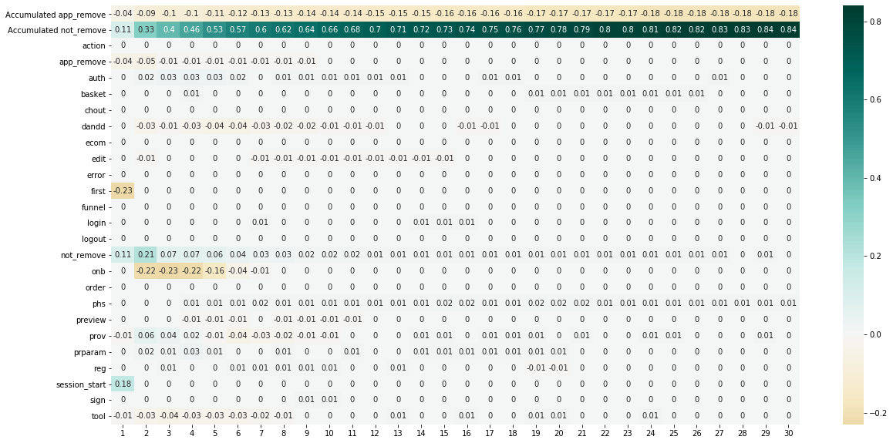

Mobile app case
~~~~~~~~~~~~~~~

This notebook can be found `here <https://github.com/retentioneering/retentioneering-tools/blob/master/examples/mobile-app-case.ipynb>`__.

In this example we will perform an analysis for the app focusing on
investigation why people remove app. Our negative target event in this
case will be “app_remove”.

.. code:: ipython3

    from retentioneering import init_config
    import pandas as pd
    
    
    init_config(
        experiments_folder='mobile-app', # folder for saving experiment results: graph visualization, heatmaps and etc.
        index_col='user_pseudo_id', # column by which we split users / sessions / whatever
        event_col='event_name', # column that describes event
        event_time_col='event_timestamp', # column that describes timestamp of event
        positive_target_event='not_remove', # name of positive target event
        pos_target_definition={},
        negative_target_event='app_remove', # name of positive target event
    )

.. code:: ipython3

    data = pd.read_csv('data/mobile-app-data.zip')
    data = data.sort_values('event_timestamp')
    # problems with timestamp order
    data.event_timestamp *= 1000
    # adds positive event
    data = data.retention.prepare()

Firstly, we need to filter and aggregate events.

To remove specific event simply click on the blue checkbox for selected
event. To aggregare group of events to single parent event click on the
smaller gray checkbox near parent event.

Now let’s remove system events, screen_view, os events, user_engagement,
from app we need just app_remove,

.. code:: ipython3

    data.retention.show_tree_selector()

.. raw:: html

    
            <iframe
                width="500"
                height="500"
                src="_static/filter.html"
                frameborder="0"
                allowfullscreen
            ></iframe>
            

After that you need to download created filter with using “Download
Filter” link.

Now you can use this filter using next chunk.

Below you can upload filter file we created for the cases we illustrate
later in this notebook

.. code:: ipython3

    data = data.retention.use_tree_filter('filter_list.json')

Lets split data into sessions

.. code:: ipython3

    data.retention.split_sessions(by_event='session_start')
    data['user_session'] = data.user_pseudo_id + data.session.astype(int).astype(str)

Analysis
========

Step matrix
-----------

.. code:: ipython3

    f = data.retention.create_filter(index_col='user_session')
    data.retention.get_step_matrix_difference(f, index_col='user_session');

From previous plot we can see that in sessions with removed app, users
significantly slows down on onboarding (onb group) and on catalogue
(prov group).

This is our first hypothesis about app problems.

Clustering
----------

.. code:: ipython3

    data.retention.learn_tsne(index_col='user_session', plot_type='clusters');

.. image:: _static/output_14_0.png

We can choose cluster from center and visualize it

We can see problems with catalogue for zero cluster: a lot of users move
from app after first prov event.

.. code:: ipython3

    data.retention.get_clusters(index_col='user_session');

.. code:: ipython3

    (data
     .retention
     .filter_cluster(1, index_col='user_session')
     .retention
     .plot_graph(index_col='user_session', thresh=0.05))

.. raw:: html

    
            <iframe
                width="600"
                height="600"
                src="_static/app-graph.html"
                frameborder="0"
                allowfullscreen
            ></iframe>
            

Selection process involves multiple steps were users edit their selected
products and select different kind of options (node “param”). Users can
do this without authorization. But after they add selected and
customized products to cart they are asked to authorize.

In this cluster we can clearly see the problem with autorization: after
authorization we need to return to catalogue (node “prov”) and start
selection and customization process all over again (node “prparam”).

We can see from graph that there is no way to return after authorization
to previous step in catalogue (no edge from “auth” to “prparam”).

This is a problem in app: authorization brokes user trajectory, so user
should return in the beginning.

We can see problems with detailed events via ``dump_event_col`` column.

.. code:: ipython3

    (data
     .retention
     .filter_cluster(1, index_col='user_session')
     .retention
     .plot_graph(index_col='user_session', cols=['dump_event_col', 'dump_event_col_shift'], thresh=0.08, width=800, height=800))

.. raw:: html

    
            <iframe
                width="900"
                height="900"
                src="_static/app-graph2.html"
                frameborder="0"
                allowfullscreen
            ></iframe>
            

This graph can support our hypothesis about bad catalogue organization
with ``prov_click_category_other`` event. We can see that users often
remove app after this event, wich redirects users to web-page. It’s
clear example of not optimal app organization where web-page link
cannibiling users from mobile app.

Predict app remove
==================

.. code:: ipython3

    # train test split
    data_train , data_test = data.retention.index_based_split(index_col='user_pseudo_id')

.. code:: ipython3

    # select group of users with trajectories longer > 20
    min_length = 20

    users_grouped = data.groupby(data.user_pseudo_id).agg({
        'event_timestamp':'count'
    })

    good_users_list = users_grouped[users_grouped['event_timestamp'] > min_length].index.values.tolist()

    #keep only users with trajectories longer than min_length
    data_test_clean = data_test[data_test.apply(lambda x: x['user_pseudo_id'] in good_users_list, axis=1)]
    data_train_clean = data_train[data_train.apply(lambda x: x['user_pseudo_id'] in good_users_list, axis=1)]

.. code:: ipython3

    # create model on train
    model = data_train_clean.retention.create_model()

.. code:: ipython3

    # make prediction and visualize the features importance on test data
    model.permutation_importance_raw(data_test_clean, target, thresh=0.6)

Output:
            ROC-AUC: 0.7141610867520931

            PR-AUC: 0.7828617829380533

            Accuracy: 0.6823385118560916