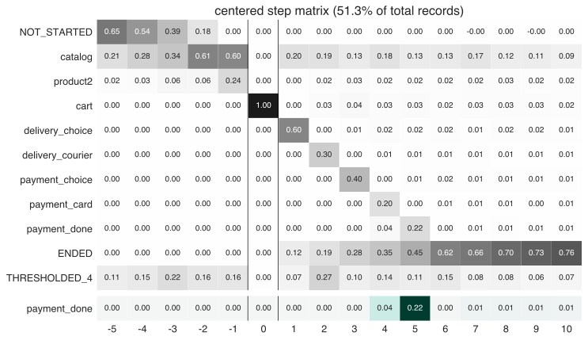

.. raw:: html

    

.. role:: red

Quick start with Retentioneering
~~~~~~~~~~~~~~~~~~~~~~~~~~~~~~~~

Retentioneering makes product analytics very easy once you have the raw data.

Every user action and every visited page or screen from your website or app,
all these interactions we call events. To understand deeply how different types
of user behavior in your product affects your business metrics, you need to
analyze the sequences of events for each user which are called user paths or
trajectories.

1. Load data
============

Retentioneering stores data in its core class ``Eventstream`` which allow to treat
a clickstream in an efficient way. To create an eventstream you can pick from any
of two options:

**Option 1. To start with our dummy online shop dataset sample.**

.. code:: ipython3

    import retentioneering as rete

    # load sample user behavior data:
    stream = rete.datasets.load_simple_shop()

In the shell of eventstream object there is a regular pandas dataframe:

.. code:: ipython3

    stream.to_dataframe().head()

.. raw:: html

    

    
    <table border="1" class="dataframe">
      <thead>
        <tr style="text-align: right;">
          <th></th>
          <th>user_id</th>
          <th>event</th>
          <th>timestamp</th>
        </tr>
      </thead>
      <tbody>
        <tr>
          <th>0</th>
          <td>219483890</td>
          <td>catalog</td>
          <td>2019-11-01 17:59:13.273932</td>
        </tr>
        <tr>
          <th>1</th>
          <td>219483890</td>
          <td>product1</td>
          <td>2019-11-01 17:59:28.459271</td>
        </tr>
        <tr>
          <th>2</th>
          <td>219483890</td>
          <td>cart</td>
          <td>2019-11-01 17:59:29.502214</td>
        </tr>
        <tr>
          <th>3</th>
          <td>219483890</td>
          <td>catalog</td>
          <td>2019-11-01 17:59:32.557029</td>
        </tr>
        <tr>
          <th>4</th>
          <td>964964743</td>
          <td>catalog</td>
          <td>2019-11-01 21:38:19.283663</td>
        </tr>
      </tbody>
    </table>
    

|

As you can see in this fragment of example dataset, user with id 219483890 has 4 events
on the website with specific timestamps on 2019-11-01. This is all you need to try out
what Retentioneering is about. You are ready to go with this dataset and proceed to step 2.

**Option 2. Alternatively, you can start with your own dataset.**

If you have your raw data of user behavior for example in csv format simply upload
it as pandas dataframe:

.. code:: ipython3

    import retentioneering as rete
    import pandas as pd

    # load your own csv
    data = pd.read_csv("yourowndatafile.csv")
    stream = rete.Eventstream(data)

We assume that the data contains at least three columns: ``user_id``, ``event``,
``timestamp``. If your columns have another names, you need either to rename them
in the pandas dataframe or explicitly set data schema. :red:`Give a link.`.

:red:`Or maybe it's better to show how to set the schema right here?`

How to get a csv file with data? Raw data in the form of {user,event,timestamp} can
be streamed via Google Analytics 360 or free Google Analytics App+Web into BigQuery.
From the BigQuery console you can run SQL query and export data into csv file,
alternatively you can use the Python BigQuery connector to get directly into the dataframe.
If you have big datasets, we suggest you take fraction of users in SQL query,
filtering by the user id (just add this condition to SQL WHERE statement to get 10%
of your users : “and ABS(MOD(FARM_FINGERPRINT(fullVisitorId), 10)) = 0)”.

2. Prepare the data
===================
Raw data is often needed to be prepared before applying analytical techniques.
Retentioneering provides a wide range of preprocessing tools which should
become a Swiss knife for a product analytics. We call them *data processors*.
With a help of data processors a product analyst easily add, delete or group
events, truncate a clickstream in a flexible manner, split the trajectories
into sessions, and many more.

Suppose you want to analyze only user first sessions instead of the whole
clickstream. Here's how you can easily achieve this using the developed data
processors:

.. code:: ipython3

    # eventstream preprocessing
    stream.split_sessions(session_cutoff=(30, "m")) \
    .filter_events(filter=lambda df_: df_['session_id'].endswith('_1')) \
    .to_dataframe()

``split_sessions`` method creates a new column ``session_id`` with the
values ending with suffix ``_<int>`` indicating the ordinary number of each
user's session. Thus, we need to leave only the records where `session_id`
ends with ``_1``. This is exactly what the next method ``filter_events`` does.
Finally, we convert the output eventstream to a pandas dataframe.

Also, for more complex preprocessing scenarios Retentioneering offers a great
graphical tool which allows you to represent sheets of preprocessing code
as a neat calculation graph. See :red:`set the link` for the details.

3. Explore the data
===================

Retentioneering has many powerful tools for exploring users behavior, including
transition graphs, step matrices, step Sankey diagrams, and cluster analysis.
Below we show just a short demo. For more details please visit the documentation
page :red:`set the link`.

**Transition graph**
`here <https://retentioneering.github.io/retentioneering-tools/_build/html/plot_graph.html>`__):
:red:`Check the link`

.. code:: ipython3

    stream.plot_graph(norm_type='full',
                      weight_col='user_id',
                      thresh=0.06,
                      targets = {'payment_done': 'green',
                                 'lost': 'red'})

.. raw:: html

            <iframe
                width="700"
                height="600"
                src="_static/transition_graph/index_3.html"
                frameborder="0"
                allowfullscreen
            ></iframe>
|

Note, that the graph is interactive and you can move the graph nodes by
clicking them and interactively zoom-in / zoom-out the graph layout.

**Step matrix**
`here <https://retentioneering.github.io/retentioneering-tools/_build/html/step_matrix.html>`__:
:red:`check the link`

.. code:: ipython3

    stream.step_matrix(max_steps=16,
                       thresh = 0.2,
                       centered={'event':'cart',
                                 'left_gap': 5,
                                 'occurrence': 1},
                       targets=['payment_done']);

**Step Sankey diagram**

**Cluster analysis**

`here <https://retentioneering.github.io/retentioneering-tools/_build/html/clustering.html>`__):

.. code:: ipython3

    stream.clusters.get_clusters(method='kmeans',
                                 n_clusters=8,
                                 ngram_range=(1,2),
                                 plot_type='cluster_bar',
                                 targets=['payment_done','cart']);

.. image:: _static/clustering/clustering_2.svg

Users with similar behavior grouped in the same cluster. Clusters with low conversion
rate can represent systematic problem in the product: specific behavior pattern which
does not lead to product goals. Obtained user segments can be explored deeper to
understand problematic behavior pattern. In the example above for instance,
cluster 4 has low conversion rate to purchase but high conversion rate to cart visit.
