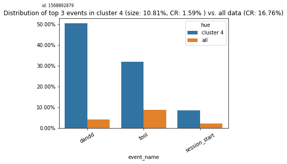
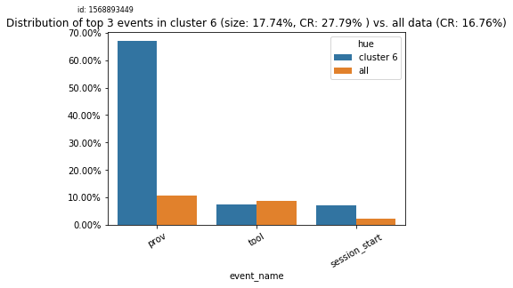
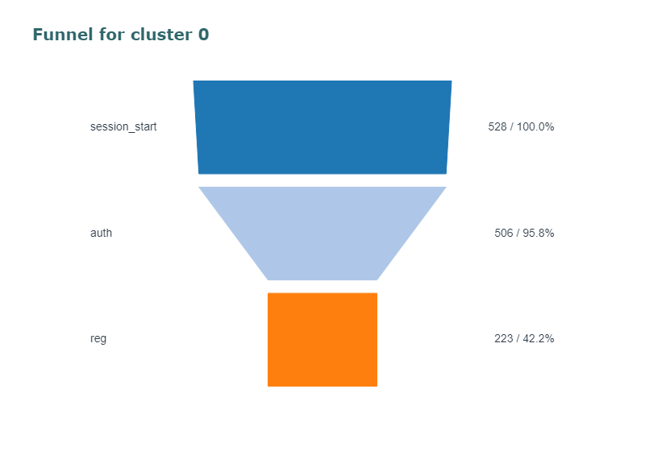
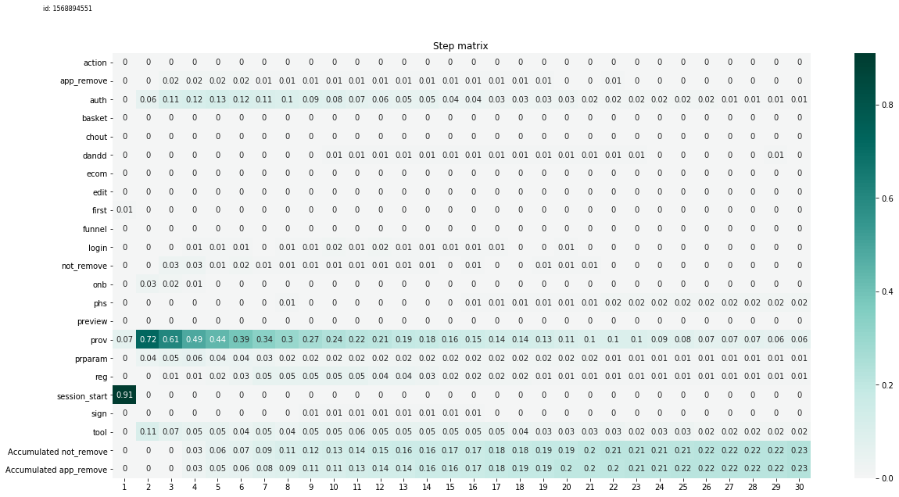
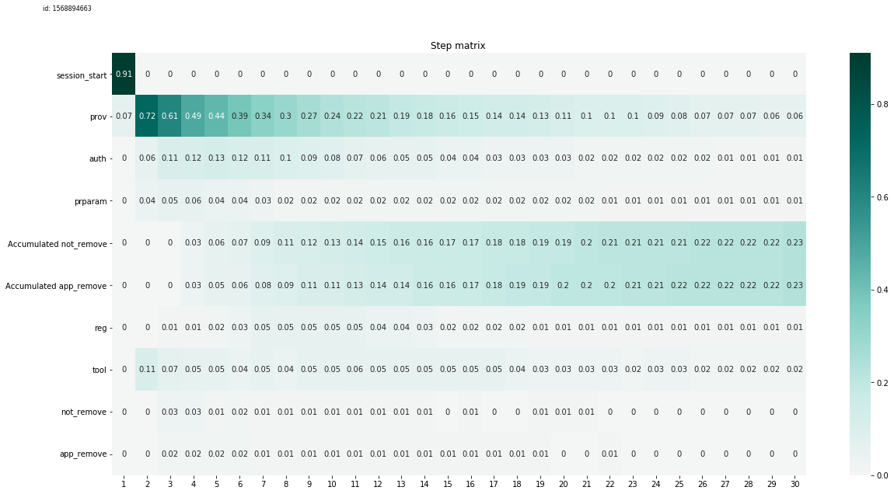
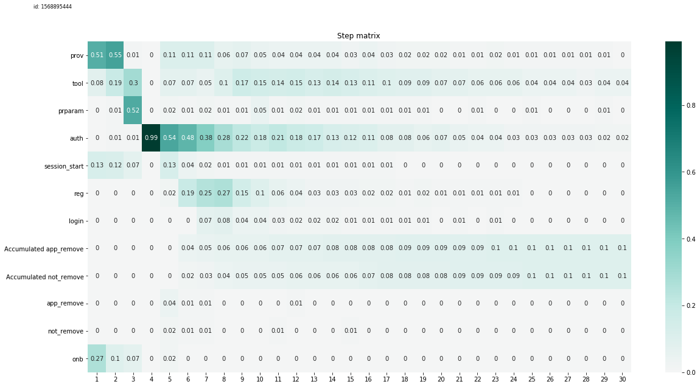

Release 1.0.4 description
==============================================

Данный кейс рассматривает пример мобильного приложения на android.

Для начала импортируем необходимые библиотеки: ``pandas`` для загрузки и
работы с данными и ``init_config`` из пакета ``retentioneering``,
которая дополняет базовый функционал pandas DataFrame функциями
``retentioneering``.

Если у вас еще не установлен ``retentioneering`` или установлена не
последняя версия, то воспользуйтесь следующей строкой

.. code:: ipython3

    ! pip3 install --upgrade retentioneering

.. code:: ipython3

    from retentioneering import init_config
    import pandas as pd

.. code:: ipython3

    data = pd.read_csv('data/mobile-app-data.zip')
    data = data.sort_values('event_timestamp')
    data.head()

.. raw:: html

    

    
    <table border="1" class="dataframe">
      <thead>
        <tr style="text-align: right;">
          <th></th>
          <th>event_timestamp</th>
          <th>event_name</th>
          <th>user_pseudo_id</th>
        </tr>
      </thead>
      <tbody>
        <tr>
          <th>4294144</th>
          <td>1551252977882000</td>
          <td>app_update</td>
          <td>d106c25cb16bb49ed4fb691b0a86ffec</td>
        </tr>
        <tr>
          <th>4294143</th>
          <td>1551260664145000</td>
          <td>sys_pause</td>
          <td>368812b20c7e3e008b5d7dd9c11b47b9</td>
        </tr>
        <tr>
          <th>4294142</th>
          <td>1551260664644001</td>
          <td>sys_stop</td>
          <td>368812b20c7e3e008b5d7dd9c11b47b9</td>
        </tr>
        <tr>
          <th>4294141</th>
          <td>1551261197311000</td>
          <td>app_update</td>
          <td>139e90855ac7f6b2116ec8e21f9c6153</td>
        </tr>
        <tr>
          <th>4294140</th>
          <td>1551262926003000</td>
          <td>app_remove</td>
          <td>7be7da240172078b5d97b6b9942091f7</td>
        </tr>
      </tbody>
    </table>
    

Теперь зададим конфиг.

У нас в данных представлено 3 колонки: 1. ``event_timestamp`` (в конфиге
соответствует колонке, описывающей время ``event_time_col``) 2.
``event_name`` (в конфиге соответствует колонке, описывающей события
``event_col``) 3. ``user_pseudo_id`` (в конфиге соответствует колонке,
описывающей индексацию траекторий ``index_col``)

В данном примере мы анализируем причины удаления приложений, поэтому в
качестве ``positive_target_event`` возьмем ``app_remove`` (firebase на
android позволяет трекать событие удаления приложения). В качестве
негативного события (``negative_target_event``) мы добавим для всех
пользователей, которые не удалили приложение событие ``not_remove``.

Для того, чтобы всем пользователям проставилось негативное событие, в
конфиг необходимо добавить определение этого события
``neg_target_definition``, оно принимает на вход словарь. Если словарь
пустой, то событие проставится для всех, у кого не было позитивного
таргета. Так же можно выделять тех пользователей, у которых не
происходило каких-либо событий в течение времени ``time_limit`` в
секундах до окончания наблюдений. Для этого в определение таргета нужно
передать следующий словарь:

::

   {
       'time_limit': 600
   }

Кроме того, можно задавать наступление таргет события, как наступление
одного из перечисленных событий:

::

   {
       'event_list': ['busket', 'chout']
   }

Для сохранения результатов всех экспериментов будем использовать папку
``experiments_folder='mobile-app'``.

Теперь мы можем описать конфигурацию ``retentioneering``. И добавить в
``pandas`` наш функционал.

.. code:: ipython3

    init_config(
        experiments_folder='mobile-app', # folder for saving experiment results: graph visualization, heatmaps and etc.
        index_col='user_pseudo_id', # column by which we split users / sessions / whatever
        event_col='event_name', # column that describes event
        event_time_col='event_timestamp', # column that describes timestamp of event
        positive_target_event='app_remove', # name of positive target event
        negative_target_event='not_remove', # name of positive target event
        neg_target_definition={},
    )

Так как это обучающий пример, то для ускорения выполнения функций
возьмем только 10% пользователей.

.. code:: ipython3

    pd.np.random.seed(0)
    
    all_usrs = data.user_pseudo_id.unique()
    sub_usrs = all_usrs[pd.np.random.permutation(all_usrs.shape[0])][:all_usrs.shape[0] // 10]
    data = data[data.user_pseudo_id.isin(sub_usrs)].reset_index(drop=True)

Применим фильтрацию и агрегацию ивентов, например, нам не нужны
технические события firebase ``screen_view`` и ``user_engagement``.

Представленный здесь файл может быть получен через вызов
``data.retention.show_tree_selector`` и агрегации по дереву событий.

.. code:: ipython3

    data = data.retention.use_tree_filter('filter_list.json')

Разделим данные на сессий пользователей по событию ``session_start``.

.. code:: ipython3

    data.retention.split_sessions(by_event='session_start')

Создадим новую колонку для индексации траекторий по сессиям

.. code:: ipython3

    data['user_session'] = data.user_pseudo_id + data.session.astype(int).astype(str)

Применим наш конфиг к данным

.. code:: ipython3

    data = data.retention.prepare()

Кластеризация
-------------

1. Новые графики (cluster_bar)
2. Метрики качества кластеризации (silhouette, stability, homogeneity,
   среднее растояние от центра кластера и среднее растояние внутри
   кластера)

Новые методы кластеризации
~~~~~~~~~~~~~~~~~~~~~~~~~~

DBSCAN
^^^^^^

Преимущества: 1. Не нужно выбирать количество кластеров 2. Автоматически
отделяет шум 3. Хорошо работает и для кластеров произвольной формы
(KMeans и Gausian Mixture предполагают, что кластера имеют сферическую
форму)

Недостатки: 1. Чувствителен к гиперпараметрам 1. В данной реализации
достаточно подобрать параметр epsq (желательно брать маленьким) 2. Долго
обучается

.. code:: ipython3

    data.retention.get_clusters(method='dbscan', epsq=0.05, index_col='user_session', plot_type='cluster_pie');

.. image:: _static/output_24_1.png

В заголовке графика ``clusters_pie`` появились разные метрики,
описывающие поведение кластеризации: 1. Silhouette показывает насколько
в среднем кластера плотные и насколько далеко они находятся от
ближайшего к ним кластера. Подробнее про это можно почитать
`тут <https://scikit-learn.org/stable/modules/clustering.html#silhouette-coefficient>`__.
2. Homogeneity показывает насколько хорошо кластеры разделяют целевых
пользователей. То есть насколько равномерны они по распределению целевых
переменных внутри.
`Подробнее <https://scikit-learn.org/stable/modules/clustering.html#homogeneity-completeness-and-v-measure>`__.
3. Clustering Stability Index измеряет как сильно меняется кластеризация
в зависимости от изменения данных. Рассчитывается по тому, как
согласуются между собой кластеризации на разных подвыборках данных.

GMM
^^^

Преимущества: 1. Обобщение KMeans 1. Дополнительно учитывает информацию
о дисперсии и ковариации расстояний между точками 2. Быстро работает

Недостатки: 1. Предпологает нормальное распределение на расстояния
внутри кластеров (по факту, это означает, что кластера должны иметь
сферическую или элиптическую форму)

.. code:: ipython3

    data.retention.get_clusters(method='GMM', n_components=3, index_col='user_session', plot_type='cluster_bar', use_csi=False, refit_cluster=True);

.. image:: _static/output_28_0.png

В качестве визуализации к этой кластеризации выбран новый метод
``plot_type='cluster_bar'``.

По оси *x* показаны разные кластера. По оси *y* отложены две метрики: 1.
Синяя шкала отражает какая доля пользователей находится в кластере
относительно всех пользователей. 2. Оранжевая шкала показывает уровень
конверсии в этом кластере.

Автоматический подбор количества кластеров в KMeans и GMM
~~~~~~~~~~~~~~~~~~~~~~~~~~~~~~~~~~~~~~~~~~~~~~~~~~~~~~~~~

Алгоритмы KMeans и Gausian Mixture, который используется по умолчанию
для кластеризации в нашем репозитории сильно чувствителен к выбору
количества кластеров. Чтобы автоматически определить оптимальное
количество кластеров в соответствие с метрикой ``silhouette`` достаточно
передать ``max_n_clusters`` в любую функцию, которая использует
кластеризацию внутри себя, например, ``data.retention.get_clusters()``
или ``data.retention.learn_tsne(plot_type='clusters')``.

.. code:: ipython3

    data.retention.get_clusters(max_n_clusters=15, index_col='user_session', plot_type='cluster_bar', use_csi=False, refit_cluster=True);

.. parsed-literal::

    Best number of clusters is 10
    

.. image:: _static/output_32_1.png

Мы видим, что функция посчитала оптимальное для нас количество кластеров
равное 10, хотя лимит, который мы задали равен 15.

Из новой визуализации четко выделяются несколько кластеров значительно
отличающихся по доле уходов внутри сессий (параметр ``Average CR``,
оранжевый столбец), кроме того, кластер 2 является самым большим из
найденных (параметр ``Cluster Size``, синий столбец)

Кластеры: 2 и 4 имеют заметно ниже среднего долю уходов, кластер 5 –
наоборот. Давайте попробуем разобраться в причинах этого

Сравнение кластеров по частотным событиям
~~~~~~~~~~~~~~~~~~~~~~~~~~~~~~~~~~~~~~~~~

.. code:: ipython3

    data.retention.cluster_event_dist(2, n=3, index_col='user_session')

.. image:: _static/output_35_0.png

Данная функция показывает распределение ``n`` самых частотных событий
для кластера в сравнении с частотой таких событий в среднем для всей
выборки. В заголовке мы видим, что кластер имеет большой размер (22.26%
от общего количества пользователей) и что в нем конверсия в удаление в
10 раз ниже, чем в среднем (1.66% против 16.76%).

Мы видим, что данный кластер характеризуется событиями прохождения
онбординга (``onb``) и первого захода пользователя в приложение
(``first``), который здесь встречаются сильно чаще, чем в среднем. Кроме
того, пользователя знакомится с асортиментом приложения (``prov``), хоть
и без заметных отличий от среднего пользователя.

.. code:: ipython3

    data.retention.cluster_event_dist(4, index_col='user_session')

Пользователи в этом кластере характеризуются активным мониторингом
доставки (``dandd``). Вероятно, это те пользователи, которые уже
заказали товар и ждут его доставки, то есть они лояльны и поэтому не
удаляют приложение.

Также кластера ``0`` и ``6`` имеют относительно большую долю уходов, мы
можем посмотреть чем они выделяются.

.. code:: ipython3

    data.retention.cluster_event_dist(0, index_col='user_session')

.. image:: _static/output_40_0.png

.. code:: ipython3

    data.retention.cluster_event_dist(6, index_col='user_session')

Здесь пользователи много исследуют каталог, видимо, не находят ничего
интересного и уходят.

Так как пользователи в обоих кластерах активно интересуются товарами,
нам может быть интересно сравнить их между собой.

.. code:: ipython3

    data.retention.cluster_event_dist(0, 6, index_col='user_session')

.. image:: _static/output_43_0.png

Мы видим, что пользователи в кластере ``6`` значительно больше исследуют
каталог, поэтому наша гипотеза о том, что они просто ничего не могут
найти, кажется, вполне легитимной.

В случае кластера ``0``, кажется, что проблема может лежать в
авторизации.

Воронки из кластеров
~~~~~~~~~~~~~~~~~~~~

Мы можем легко посмотреть воронку из начала сессий в авторизацию и
регистрацию пользователей в кластере ``0``.

.. code:: ipython3

    data.retention.cluster_funnel(0, ['session_start', 'auth', 'reg'], index_col='user_session')

.. parsed-literal::

    ['528 / 100.0%', '506 / 95.8%', '223 / 42.2%']
    

Мы видим, что ~96% пользователей из этого кластера проходят авторизацию,
а 42% еще и регистрацию.

Использование метаданных для кластеризации
~~~~~~~~~~~~~~~~~~~~~~~~~~~~~~~~~~~~~~~~~~

.. code:: ipython3

    # возьмем первые две колонки из Tf-Idf в качестве метаинфы о пользователях
    
    metadata = data.retention.extract_features().iloc[:, :2]
    metadata.head()

.. raw:: html

    

    
    <table border="1" class="dataframe">
      <thead>
        <tr style="text-align: right;">
          <th></th>
          <th>action</th>
          <th>auth</th>
        </tr>
      </thead>
      <tbody>
        <tr>
          <th>0026d75cd77c9b3acfb725440f35de81</th>
          <td>0.0</td>
          <td>0.090090</td>
        </tr>
        <tr>
          <th>003cadd4d4361b5cc2c8c9912b221b17</th>
          <td>0.0</td>
          <td>0.063512</td>
        </tr>
        <tr>
          <th>00536fd2f1d3be802ad01901a1fcff39</th>
          <td>0.0</td>
          <td>0.014476</td>
        </tr>
        <tr>
          <th>0086bdf8602520f2335fddbe6f80b2ec</th>
          <td>0.0</td>
          <td>0.007145</td>
        </tr>
        <tr>
          <th>00a849c09164215b493ee5ede8cb4ad1</th>
          <td>0.0</td>
          <td>0.000000</td>
        </tr>
      </tbody>
    </table>
    

Мы можем использовать метаинформацию о пользователе в любой функции,
которая извлекает фичи: ``data.retention.extract_features``,
``data.retention.get_clusters``, ``data.retention.learn_tsne``,
``data.retention.create_model``.

Пространство Tf-Idf фичей обычно имеет очень высокую размерность,
поэтому будет “перетягивать” на себя эффект от метаинформации о
пользователях. Чтобы решить эту проблему можно “уплотнить” Tf-Idf фичи,
используя параметр ``manifold_type``. Использовать можно любой метод из
`sklearn.manifold <https://scikit-learn.org/stable/modules/manifold.html>`__
и
`sklearn.decomposition <https://scikit-learn.org/stable/modules/classes.html#module-sklearn.decomposition>`__.
Параметры для этих трансформаций можно найти в документации sklearn.

.. code:: ipython3

    feats = data.retention.extract_features(metadata=metadata, manifold_type='TruncatedSVD', n_components=6)

.. code:: ipython3

    feats.head()

.. raw:: html

    

    
    <table border="1" class="dataframe">
      <thead>
        <tr style="text-align: right;">
          <th></th>
          <th>0</th>
          <th>1</th>
          <th>2</th>
          <th>3</th>
          <th>4</th>
          <th>5</th>
          <th>action</th>
          <th>auth</th>
        </tr>
      </thead>
      <tbody>
        <tr>
          <th>0026d75cd77c9b3acfb725440f35de81</th>
          <td>0.414893</td>
          <td>-0.009670</td>
          <td>-0.124985</td>
          <td>0.058457</td>
          <td>-0.040044</td>
          <td>-0.019037</td>
          <td>0.0</td>
          <td>0.090090</td>
        </tr>
        <tr>
          <th>003cadd4d4361b5cc2c8c9912b221b17</th>
          <td>0.391733</td>
          <td>-0.010204</td>
          <td>-0.092171</td>
          <td>0.084612</td>
          <td>-0.015011</td>
          <td>-0.016283</td>
          <td>0.0</td>
          <td>0.063512</td>
        </tr>
        <tr>
          <th>00536fd2f1d3be802ad01901a1fcff39</th>
          <td>0.551056</td>
          <td>-0.051195</td>
          <td>0.436535</td>
          <td>-0.045267</td>
          <td>-0.025950</td>
          <td>0.007235</td>
          <td>0.0</td>
          <td>0.014476</td>
        </tr>
        <tr>
          <th>0086bdf8602520f2335fddbe6f80b2ec</th>
          <td>0.693580</td>
          <td>-0.066825</td>
          <td>0.529845</td>
          <td>-0.107563</td>
          <td>-0.031253</td>
          <td>-0.000819</td>
          <td>0.0</td>
          <td>0.007145</td>
        </tr>
        <tr>
          <th>00a849c09164215b493ee5ede8cb4ad1</th>
          <td>0.260537</td>
          <td>-0.002831</td>
          <td>-0.076230</td>
          <td>0.091328</td>
          <td>-0.117505</td>
          <td>-0.018233</td>
          <td>0.0</td>
          <td>0.000000</td>
        </tr>
      </tbody>
    </table>
    

Step matrix
-----------

Step matrix показавыет какова была доля разных событий на каждом шаге
действий (по сути, номер события в траектории) пользователей.

Step matrix difference – показывает разницу между такими распределениями
для разных групп или кластеров. Такая разность, позволяет заметить
характерные отличия в поведении между двумя группами.

В step_matrix и step_matrix_difference добавлены 1. Автоматическая
сортировка 2. Фильтрация маленьких значений по порогу

Давайте вернемся к нашему примеру и посмотрим на step matrix для
кластеров ``0`` и ``6``.

Так было в старой версии:

.. code:: ipython3

    clusters = data.retention.filter_cluster([0, 6], index_col='user_session')
    clusters.retention.get_step_matrix(sorting=False, index_col='user_session');

Сейчас добавилась сортировка, которая позволяет сразу увидеть типичную
послодевотельность действий (воронку) проще.

.. code:: ipython3

    clusters.retention.get_step_matrix(index_col='user_session');

.. image:: _static/output_60_0.png

Если добавить фильтрацию, то step matrix станет еще проще для чтения

.. code:: ipython3

    clusters.retention.get_step_matrix(thr=0.03, index_col='user_session');

.. parsed-literal::

    
            Unused events on first 30 steps:
                app_remove
    	not_remove
    	Accumulated not_remove
    	Accumulated app_remove
            
    

Сравнение кластеров
~~~~~~~~~~~~~~~~~~~

Теперь давайте посмотрим на разницу между двумя кластерами

.. code:: ipython3

    f = clusters.retention.create_filter(cluster_list=[0], cluster_mapping=data.retention.cluster_mapping, index_col='user_session')
    clusters.retention.get_step_matrix_difference(f, thr=0.03);

.. parsed-literal::

    
            Unused events on first 30 steps:
                Accumulated app_remove
    	Accumulated not_remove
    	app_remove
    	not_remove
            
    

.. image:: _static/output_65_1.png

Здесь четко видно, что группа пользователей из кластера ``0`` больше
акцентируются на авторизации, проходят к выбору свойств товара
(``prparam``) и регистрации в приложении.

Обратная step matrix
~~~~~~~~~~~~~~~~~~~~

Кроме того, нам может быть интересно посмотреть на step matrix в
обратном порядке. Это увидеть траекторию пользователя не с самого
начала, а только лишь ту часть, которая приводит пользователя в тот или
иной таргет.

Давайте посмотрим на кластер ``0`` с помощью такой матрицы.

.. code:: ipython3

    clusters[f].retention.get_step_matrix(reverse='pos', thr=0.03);

.. parsed-literal::

    
            Unused events on first 30 steps:
                app_remove
            
    

.. image:: _static/output_70_2.png

Из графика четко видно, что перед ``app_remove`` чаще всего возникают
события авторизации и исследования каталога. То есть пользователи не
хотят или не могут авторизоваться.

Фильтрация данных по событию и его окружению
~~~~~~~~~~~~~~~~~~~~~~~~~~~~~~~~~~~~~~~~~~~~

Нам может быть интересно посмотреть только на конкретное событие, откуда
в него попадают пользователи и куда потом уходят

.. code:: ipython3

    sample = data.retention.filter_event_window('auth')

.. code:: ipython3

    sample.retention.get_step_matrix(thr=0.05);

.. parsed-literal::

    
            Unused events on first 30 steps:
                app_remove
    	not_remove
    	Accumulated not_remove
    	Accumulated app_remove
            
    

Чаще всего в авторизацию пользователи попадают после выбора параметров
товара, то есть уже довольно глубоко по воронке. Чтобы более подробно
исследовать эту траекторию, нужен граф.

Теперь целевые действия не удаляются из графов даже если должны отфильтроваться по thresh
~~~~~~~~~~~~~~~~~~~~~~~~~~~~~~~~~~~~~~~~~~~~~~~~~~~~~~~~~~~~~~~~~~~~~~~~~~~~~~~~~~~~~~~~~

Старая версия.

.. code:: ipython3

    sample.retention.plot_graph(thresh=0.2, targets=[])

.. raw:: html

    
            <iframe
                width="700"
                height="700"
                src="_static/index_2019-09-19 15_23_03_718246.html"
                frameborder="0"
                allowfullscreen
            ></iframe>
            

.. parsed-literal::

    'mobile-app/index_2019-09-19 15_23_03_718246.html'

Новая версия

.. code:: ipython3

    sample.retention.plot_graph(thresh=0.2)

.. raw:: html

    
            <iframe
                width="700"
                height="700"
                src="_static/index_2019-09-19 15_22_18_609911.html"
                frameborder="0"
                allowfullscreen
            ></iframe>
            

.. parsed-literal::

    'mobile-app/index_2019-09-19 15_22_18_609911.html'

Из графа выше видно, что пользователи после авторизации напрямую не
попадают обратно в выбор параметров товара или другие более глубокие
этапы воронки.

