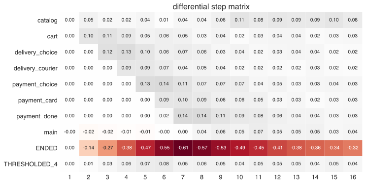

Step_matrix function
~~~~~~~~~~~~~~~~~~~~

Step matrix intro
=================

Step matrix is a very powerful tool in retentioneering arsenal. It allows quickly get high-level
understing of user behaviour.

To better understand how `step_matrix` works let's first consider intuitive example. Let's say we
are analyzing web-store logs and have dataset with event logs from four user sessions with the following
events in following order:

.. image:: _static/step_matrix/step_matrix_demo.svg

We can visualize this dataset as a heatmap indicating what fraction of users were at wich step in
their trajectories:

.. image:: _static/step_matrix/step_matrix_demo_plot.svg

Basic example
=============

This notebook can be found `here <https://github.com/retentioneering/retentioneering-tools/blob/master/examples/step_matrix.ipynb>`__.

This document describes available functionality for step_matrix function.

To run examples below we need to import retentioneering, import sample dataset and setup config:

.. code:: ipython3

    import retentioneering

    # load sample data
    from retentioneering import datasets
    data = datasets.load_simple_shop()

    # update config to specify column names
    retentioneering.config.update({
        'event_col':'event',
        'event_time_col':'timestamp',
        'index_col': 'client_id'
    })

To understand intuitively what is step_matrix let us begin with plotting step_matrix
for extremely simple dataset containg events for only one user:

.. code:: ipython3

    single_user = data[data['client_id']==613604495].reset_index(drop=True)
    single_user

.. raw:: html

    

    
    <table border="1" class="dataframe">
      <thead>
        <tr style="text-align: right;">
          <th></th>
          <th>client_id</th>
          <th>event</th>
          <th>timestamp</th>
        </tr>
      </thead>
      <tbody>
        <tr>
          <th>0</th>
          <td>613604495</td>
          <td>main</td>
          <td>2019-11-02 23:25:03.672939</td>
        </tr>
        <tr>
          <th>1</th>
          <td>613604495</td>
          <td>catalog</td>
          <td>2019-11-02 23:25:07.390498</td>
        </tr>
        <tr>
          <th>2</th>
          <td>613604495</td>
          <td>catalog</td>
          <td>2019-11-02 23:25:48.043605</td>
        </tr>
        <tr>
          <th>3</th>
          <td>613604495</td>
          <td>product2</td>
          <td>2019-11-02 23:26:08.845033</td>
        </tr>
        <tr>
          <th>4</th>
          <td>613604495</td>
          <td>cart</td>
          <td>2019-11-02 23:26:37.007346</td>
        </tr>
        <tr>
          <th>5</th>
          <td>613604495</td>
          <td>catalog</td>
          <td>2019-11-02 23:26:38.406224</td>
        </tr>
        <tr>
          <th>6</th>
          <td>613604495</td>
          <td>cart</td>
          <td>2019-11-02 23:27:09.279245</td>
        </tr>
        <tr>
          <th>7</th>
          <td>613604495</td>
          <td>catalog</td>
          <td>2019-11-02 23:27:11.432713</td>
        </tr>
        <tr>
          <th>8</th>
          <td>613604495</td>
          <td>product2</td>
          <td>2019-11-02 23:27:43.193619</td>
        </tr>
        <tr>
          <th>9</th>
          <td>613604495</td>
          <td>cart</td>
          <td>2019-11-02 23:27:48.110186</td>
        </tr>
        <tr>
          <th>10</th>
          <td>613604495</td>
          <td>delivery_choice</td>
          <td>2019-11-02 23:27:48.292051</td>
        </tr>
        <tr>
          <th>11</th>
          <td>613604495</td>
          <td>delivery_pickup</td>
          <td>2019-11-02 23:27:59.789239</td>
        </tr>
      </tbody>
    </table>
    

|

Let's plot a simple intuitive step_matrix for our single user dataset:

.. code:: ipython3

    single_user.rete.step_matrix(max_steps=16);

.. image:: _static/step_matrix/step_matrix_su_0.svg

We can see since we have only one user in this example, `step_matrix` contains only 0's and 1's.
At step 1 user had event `main` (100% of users have event main as first event in the trajecotry),
then at step 2 user proceed to `catalog`, etc., etc., etc. By the step 13 user's trajectory
ended and there are no more events, therefore all subsequent events starting from step 13 are
special events `ENDED` indicating no other events present.

Let's now plot `step_matrix` for the full dataset containing all users:

.. code:: ipython3

    data.rete.step_matrix(max_steps=16);

.. image:: _static/step_matrix/step_matrix_0.svg

By looking at the first column we can immediately say that users in the analyzed cohort start
their sessions from events `catalog` (72%) and `main` (28%). At step 2 12% of users already
ended their sessions and have no other events (row `ENDED` at step 2 is 0.12). We can see, that
52% of users finish their sessions with 6 or less events (row `ENDED` at step 7 is 0.52). Some
convertions start happen after step 7 (row `payment_done` have 0.02 at step 7). And so on. Note,
that at each step all values in every column always sum up to 1 (meaning that all users have some
specific event or `ENDED` state). Below we will explore other options for `step_matrix` function to make the output much more
informative and tailored for the goals of particular analysis.

Thresholding
============

When we plot `step_matrix` using full dataset sometimes we want first focus on bigger picture and
avoid rows with event where insignificant fraction of users experienced. Such thresholding can be
done using `thresh` parameter (float, default: 0). If the row has all values less than specified
`thresh`, such row will not be shown.

.. code:: ipython3

    data.rete.step_matrix(max_steps=16,
                          thresh=0.05);

.. image:: _static/step_matrix/step_matrix_1.svg

All events cutted away by thresholding are grouped together in `THRESHOLDED_X` row, where X - is
the total number of dropped events.

Add targets analysis
====================

Very often there are specific events of particular importance for product analyst (for example
such as `cart`, or `order_confirmed`, or `subscribe`, etc.). Often such events have much lower
convertion rate comparing other events (like `main page` or `catalog`) and often ended up thresholded
from `step_matrix` or shown with non-informative coloring. In this case we can isolate those events of
particular importance (`targets`) to individual rows, each of which will have their individual color scale.
This can be done with parameter `targets`:

.. code:: ipython3

    data.rete.step_matrix(max_steps=16,
                          thresh=0.05,
                          targets=['payment_done']);

.. image:: _static/step_matrix/step_matrix_2.svg

Specified target events are always shown below regardless of selected threshold. Multiple targets can be
included as a list:

.. code:: ipython3

    data.rete.step_matrix(max_steps=16,
                          thresh=0.05,
                          targets=['product1','cart','payment_done']);

.. image:: _static/step_matrix/step_matrix_3.svg

If we want to compare some targets and plot them using same color scaling, we can combine
them in sub-list inside the `targets` list:

.. code:: ipython3

    data.rete.step_matrix(max_steps=16,
                          thresh=0.05,
                          targets=['product1',['cart','payment_done']]);

.. image:: _static/step_matrix/step_matrix_4.svg

Now we can visually compare by color how mamy users reach `cart` vs `payment_done` at particular
step in their trajectory.

Targets can be presented as accumulated values (or both):

.. code:: ipython3

    data.rete.step_matrix(max_steps=16,
                          thresh=0.05,
                          targets=['product1',['cart','payment_done']],
                          accumulated='only');

.. image:: _static/step_matrix/step_matrix_5.svg

.. code:: ipython3

    data.rete.step_matrix(max_steps=16,
                          thresh=0.05,
                          targets=['product1',['cart','payment_done']],
                          accumulated='both');

.. image:: _static/step_matrix/step_matrix_6.svg

Centered step matrix
====================

Sometimes we are interested in flow of users through specific event: how do users reach
specific event and what do they do after? This information can be visualized with step_marix
using parameter centered:

.. code:: ipython3

    data.rete.step_matrix(max_steps=16,
                          thresh = 0.2,
                          centered={'event':'cart',
                                    'left_gap':5,
                                    'occurrence':1});

.. image:: _static/step_matrix/step_matrix_7.svg

Note, that when plot step_matrix with parameter centered we only keep users who have reached
specified event (the column 0 has value 1 at specified event)

We can use all targets functionality with centered step_matrix, for example:

.. code:: ipython3

    data.rete.step_matrix(max_steps=16,
                          thresh = 0.2,
                          centered={'event':'cart',
                                    'left_gap':5,
                                    'occurrence':1},
                          targets=['payment_done']);

.. image:: _static/step_matrix/step_matrix_8.svg

Differential step matrix
========================

Sometimes we need to compare behavior of several groups of users. For example,

In this case it is informative to plot a step_matrix as difference between step_matrix for
group_A and step_matrix for group_B. This can be done using parameter

.. code:: ipython3

    g1 = set(data[data['event']=='payment_done']['client_id'].unique())
    g2 = set(data['client_id'].unique()) - g1

    data.rete.step_matrix(max_steps=16,
                          thresh = 0.05,
                          groups=(g1, g2));

